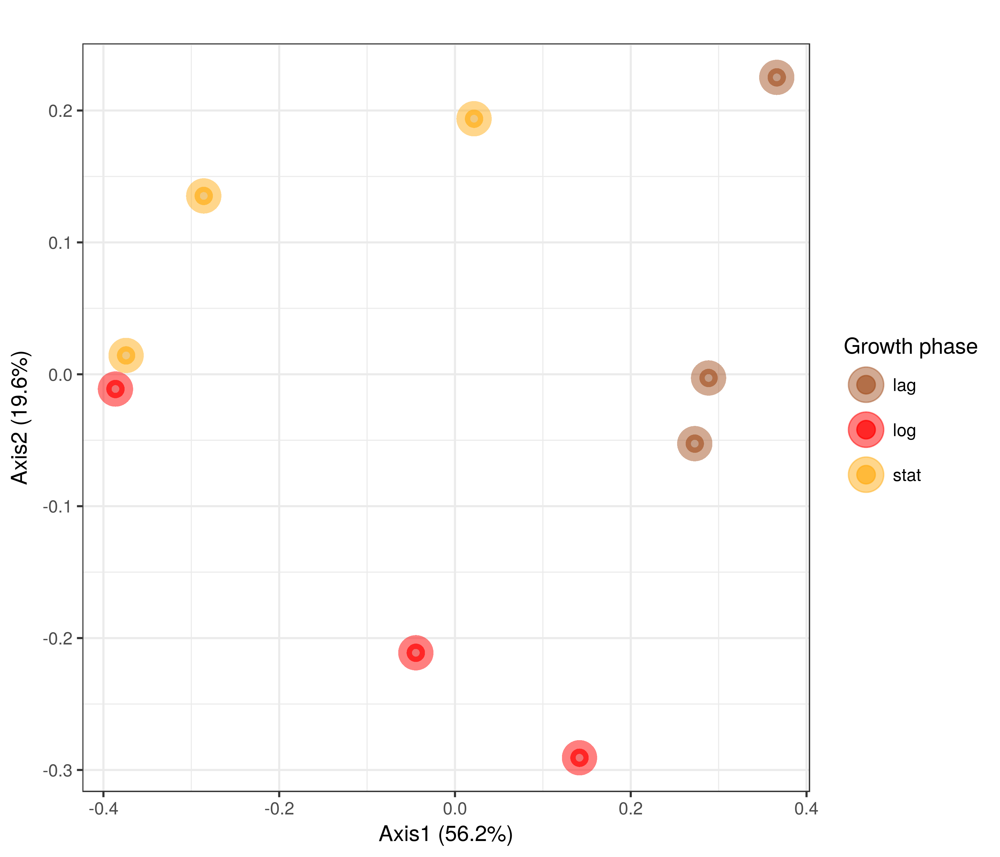
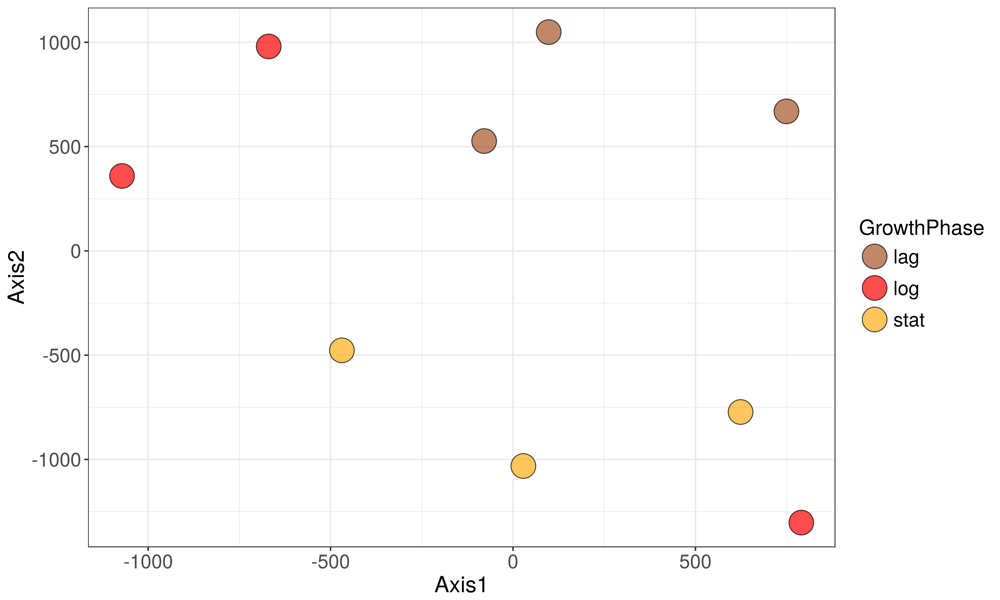

# Load libraries


```r
library("Phenoflow")
library("mclust")
library("plyr")
library("dplyr")
library("gridExtra")
library("tidyr")
library("phyloseq")
library("ggplot2")
library("gridExtra")
library("fpc")
library("RColorBrewer")
library("vegan")
library("tsne")
library("sandwich")
library("cluster")
library("grid")
library("egg")
library("MALDIquant")
library("reshape2")
library("caret") # for cross validation
library("foreach") # for parallelization
source("functions.R")
library("flowAI") # for denoising of FCM data
load("workspace.RData")

my.settings <- list(
  strip.background=list(col="transparent"),
  strip.border=list(col="transparent", cex=5),
  gate=list(col="black", fill="lightblue", alpha=0.2,border=NA,lwd=2),
  panel.background=list(col="lightgray"),
  background=list(col="white"))
```

# Cluster analysis
<!-- ## A. Hyperspec-normalized spectra -->
<!-- We will start with the hyperspec processed spectr:   -->

<!-- * Select number of stable clusters in data set -->
<!-- * Map back to original samples -->
<!-- * Calculate phenotypic diversity in each sample using Hill numbers -->

<!-- ```{r determine-clusters, fig.width = 7, fig.height= 6, dpi = 500, warning=FALSE} -->
<!-- # Choose if you want to run PCA prior to clustering -->
<!-- PCA <- FALSE -->

<!-- if(PCA == TRUE){ -->
<!--   # Perform PCA to reduce number of features in fingerprint -->
<!--   pca_bacteria <- prcomp(hs.norm) -->

<!--   # Only retain PC which explain 90% of the variance -->
<!--   thresh <- 0.9 -->
<!--   nr_pc_bacteria <- min(which((cumsum(vegan::eigenvals(pca_bacteria)/sum(vegan::eigenvals(pca_bacteria)))>thresh) == TRUE)) -->
<!--   pc_cluster_bacteria <- pca_bacteria$x[, 1:nr_pc_bacteria] -->
<!-- } else { -->
<!--   pc_cluster_bacteria <- hs.norm -->
<!-- } -->

<!-- # Evaluate number of robust clusters by means of silhouette index -->
<!-- # We limit the search to 50 clusters -->
<!-- tmp.si <- c() -->
<!-- for(i in 2:50){ -->
<!--   if(i%%10 == 0) cat(date(), paste0("---- at k =  ", i, "/",  nrow(pc_cluster_bacteria), "\n")) -->
<!--   tmp.si[i] <- pam(pc_cluster_bacteria, k = i)$silinfo$avg.width -->
<!-- } -->
<!-- nr_clusters_bacteria <- which(tmp.si == max(tmp.si, na.rm = TRUE)) -->

<!-- # Plot Silhouette index distribution -->
<!-- plot(tmp.si, type = "l", ylab = "Silhouette index",  -->
<!--      xlab = "Number of clusters") -->

<!-- # Cluster samples and export cluster labels -->
<!-- clusters_bacteria <- pam(pc_cluster_bacteria, k = nr_clusters_bacteria) -->

<!-- # Extract cluster labels -->
<!-- cluster_labels_pam <- data.frame(Sample = names(clusters_bacteria$clustering), -->
<!--                                       cluster_label = clusters_bacteria$clustering) -->

<!-- # Method 2: the Mclust( ) function in the mclust package selects the optimal model according to BIC for EM initialized by hierarchical clustering for parameterized Gaussian mixture models. -->
<!-- BIC = mclustBIC(pc_cluster_bacteria$spc, G = c(1:20)) -->
<!-- plot(BIC);lines(x = c(13, 13), y = c(0, 10e6), col = "red", lty = 2) -->
<!-- mc_fit <- Mclust(pc_cluster_bacteria, G = 13) -->

<!-- # plot(fit) # plot results  -->
<!-- summary(mc_fit) # display the best model -->

<!-- cluster_labels_mc <- data.frame(Sample = names(clusters_bacteria$clustering), -->
<!--                                       cluster_label = mc_fit$classification) -->

<!-- # To compare both clustering approaches: -->
<!-- # cluster.stats(dist(hs.norm), mc_fit$classification, clusters_bacteria$clustering) -->

<!-- # Extract count table (i.e. "operational phenotypic unit table") for each sample -->
<!-- OPU_hs_pam <- data.frame(table(cluster_labels_pam)) -->
<!-- # print(OPU_hs_pam) -->

<!-- OPU_hs_mc <- data.frame(table(cluster_labels_mc)) -->
<!-- # print(OPU_hs_mc) -->

<!-- # Merge cluster outputs in long format df -->
<!-- OPU_hs_merged <- rbind(OPU_hs_pam, OPU_hs_mc) -->
<!-- OPU_hs_merged <- data.frame(OPU_hs_merged, method = -->
<!--                               c(rep("PAM", nrow(OPU_hs_pam)), -->
<!--                                 rep("Mclust", nrow(OPU_hs_mc))),  -->
<!--                             replicate = do.call(rbind, strsplit(as.character(OPU_hs_merged$Sample), " "))[, 2], -->
<!--                             growth_phase = do.call(rbind, strsplit(as.character(OPU_hs_merged$Sample), " "))[, 1]) -->
<!-- colnames(OPU_hs_merged)[colnames(OPU_hs_merged) == "cluster_label"] <- "OPU" -->
<!-- ``` -->

<!-- # Plot OPU table -->
<!-- ```{r plot-clusters, fig.width = 7, fig.height= 6, dpi = 500, warning=FALSE} -->
<!-- # Plot according to metadata -->
<!-- p1 <- ggplot(OPU_hs_merged, aes(x = replicate, y = Freq, fill = OPU))+ -->
<!--   geom_bar(stat = "identity")+ -->
<!--   scale_fill_brewer(palette = "Paired")+ -->
<!--   theme_bw()+ -->
<!--   facet_grid(method ~ growth_phase, scales = "free")+ -->
<!--    theme(axis.title=element_text(size=16), strip.text=element_text(size=16), -->
<!--         legend.title=element_text(size=15),legend.text=element_text(size=14), -->
<!--         axis.text = element_text(size=14),title=element_text(size=20), -->
<!--         axis.text.x = element_text(angle = 45, hjust = 1), -->
<!--         strip.background=element_rect(fill=adjustcolor("lightgray",0.2)) -->
<!--         #,panel.grid.major = element_blank(), panel.grid.minor = element_blank() -->
<!--         ) -->

<!-- print(p1) -->
<!-- ``` -->

## B. Maldiquant-normalized spectra  

Same analysis as for hyperspec-normalized spectra.


```r
# Convert massSpectrum object to hyperspec
wv_mq <- mass(mq.norm[[1]])
matrix.spectra <- matrix(nrow=length(mq.norm), ncol = length(wv_mq))
for (i in 1:length(mq.norm)){
  matrix.spectra[i,] <- intensity(mq.norm[[i]])
}
hs.mq <- new("hyperSpec", spc = matrix.spectra, wavelength = wv_mq, labels = cell.name)
```

```
## Error in getClass(Class, where = topenv(parent.frame())): "hyperSpec" is not a defined class
```

```r
# Choose if you want to run PCA prior to clustering
PCA <- FALSE
PEAKS <- FALSE

if(PCA == TRUE){
  # Perform PCA to reduce number of features in fingerprint
  pca_bacteria <- prcomp(hs.mq)

  # Only retain PC which explain 90% of the variance
  thresh <- 0.9
  nr_pc_bacteria <- min(which((cumsum(vegan::eigenvals(pca_bacteria)/sum(vegan::eigenvals(pca_bacteria)))>thresh) == TRUE))
  pc_cluster_bacteria <- pca_bacteria$x[, 1:nr_pc_bacteria]
} else if(PEAKS == TRUE){
  # Run peak detection algorithm
    peaks <- detectPeaks(mq.norm, method="MAD", halfWindowSize=1, SNR=0.001)
    plot(mq.norm[[1]], xlim=c(600, 1800))
    points(peaks[[1]], col="red", pch=4)

    # Tolerance for wave number shift
    peaks <- binPeaks(peaks, tolerance = 0.002)
  
    # Filter out intensities at peak wave numbers
    peaks <- filterPeaks(peaks, minFrequency = 0.25)

    pc_cluster_bacteria <- intensityMatrix(peaks, mq.norm)
} else {
  pc_cluster_bacteria <- hs.mq
}
```

```
## Error in eval(expr, envir, enclos): object 'hs.mq' not found
```

```r
# Evaluate number of robust clusters by means of silhouette index
# We limit the search to 50 clusters
tmp.si <- c()
for(i in 2:50){
  if(i%%10 == 0) cat(date(), paste0("---- at k =  ", i, "/",  nrow(pc_cluster_bacteria), "\n"))
  tmp.si[i] <- pam(pc_cluster_bacteria, k = i)$silinfo$avg.width
}
```

```
## Error in pam(pc_cluster_bacteria, k = i): object 'pc_cluster_bacteria' not found
```

```r
nr_clusters_bacteria <- which(tmp.si == max(tmp.si, na.rm = TRUE))

# Plot Silhouette index distribution
plot(tmp.si, type = "l", ylab = "Silhouette index", 
     xlab = "Number of clusters")
```

```
## Error in plot.window(...): need finite 'xlim' values
```


```r
# Cluster samples and export cluster labels
clusters_bacteria <- pam(pc_cluster_bacteria, k = nr_clusters_bacteria)
```

```
## Error in inherits(x, "dist"): object 'pc_cluster_bacteria' not found
```

```r
# Extract cluster labels
cluster_labels_pam <- data.frame(Sample = cell.name,
                                      cluster_label = clusters_bacteria$clustering)
```

```
## Error in data.frame(Sample = cell.name, cluster_label = clusters_bacteria$clustering): object 'clusters_bacteria' not found
```

```r
# Method 2: the Mclust( ) function in the mclust package selects the optimal model according to BIC for EM initialized by hierarchical clustering for parameterized Gaussian mixture models.
if(PEAKS == TRUE){
  mc_fit <- Mclust(as.matrix(pc_cluster_bacteria))
} else {
  mc_fit <- Mclust(pc_cluster_bacteria, G = 13)
}
```

```
## Error in is.data.frame(frame): object 'pc_cluster_bacteria' not found
```

```r
# plot(fit) # plot results 
summary(mc_fit) # display the best model
```

```
## Error in summary(mc_fit): object 'mc_fit' not found
```

```r
cluster_labels_mc <- data.frame(Sample = cell.name,
                                      cluster_label = mc_fit$classification)
```

```
## Error in data.frame(Sample = cell.name, cluster_label = mc_fit$classification): object 'mc_fit' not found
```

```r
# To compare both clustering approaches:
# cluster.stats(dist(hs.mq), mc_fit$classification, clusters_bacteria$clustering)

# Extract count table (i.e. "operational phenotypic unit table") for each sample
OPU_mq_pam <- data.frame(table(cluster_labels_pam))
```

```
## Error in table(cluster_labels_pam): object 'cluster_labels_pam' not found
```

```r
# print(OPU_hs_pam)

OPU_mq_mc <- data.frame(table(cluster_labels_mc))
```

```
## Error in table(cluster_labels_mc): object 'cluster_labels_mc' not found
```

```r
# print(OPU_hs_mc)

# Merge cluster outputs in long format df
OPU_mq_merged <- rbind(OPU_mq_pam, OPU_mq_mc)
```

```
## Error in rbind(OPU_mq_pam, OPU_mq_mc): object 'OPU_mq_pam' not found
```

```r
OPU_mq_merged <- data.frame(OPU_mq_merged, method =
                              c(rep("PAM", nrow(OPU_mq_pam)),
                                rep("Mclust", nrow(OPU_mq_mc))), 
                            replicate = do.call(rbind, strsplit(as.character(OPU_mq_merged$Sample), " "))[, 2],
                            growth_phase = do.call(rbind, strsplit(as.character(OPU_mq_merged$Sample), " "))[, 1])
```

```
## Error in data.frame(OPU_mq_merged, method = c(rep("PAM", nrow(OPU_mq_pam)), : object 'OPU_mq_merged' not found
```

```r
colnames(OPU_mq_merged)[colnames(OPU_mq_merged) == "cluster_label"] <- "OPU"
```

```
## Error in colnames(OPU_mq_merged)[colnames(OPU_mq_merged) == "cluster_label"] <- "OPU": object 'OPU_mq_merged' not found
```

# Plot OPU table

```r
p2 <- ggplot(OPU_mq_merged, aes(x = replicate, y = Freq, fill = OPU))+
  geom_bar(stat = "identity")+
  scale_fill_brewer(palette = "Paired")+
  theme_bw()+
  facet_grid(method ~ growth_phase, scales = "free")+
   theme(axis.title=element_text(size=16), strip.text=element_text(size=16),
        legend.title=element_text(size=15),legend.text=element_text(size=14),
        axis.text = element_text(size=14),title=element_text(size=20),
        axis.text.x = element_text(angle = 45, hjust = 1),
        strip.background=element_rect(fill=adjustcolor("lightgray",0.2))
        #,panel.grid.major = element_blank(), panel.grid.minor = element_blank()
        )
```

```
## Error in ggplot(OPU_mq_merged, aes(x = replicate, y = Freq, fill = OPU)): object 'OPU_mq_merged' not found
```

```r
print(p2)
```

```
## Error in print(p2): object 'p2' not found
```

# PhenoRam diversity

```r
# Format PAM clusters into otu tables
OPU_pam_table <- OPU_mq_merged %>% filter(method == "PAM") %>% select(c("Sample","OPU","Freq")) %>% tidyr::spread(OPU, Freq)
```

```
## Error in eval(lhs, parent, parent): object 'OPU_mq_merged' not found
```

```r
rownames(OPU_pam_table) <- OPU_pam_table$Sample
```

```
## Error in eval(expr, envir, enclos): object 'OPU_pam_table' not found
```

```r
OPU_pam_table <- OPU_pam_table[, -1]
```

```
## Error in eval(expr, envir, enclos): object 'OPU_pam_table' not found
```

```r
OPU_pam_tax <- as.matrix(data.frame(OPU = colnames(OPU_pam_table)))
```

```
## Error in colnames(OPU_pam_table): object 'OPU_pam_table' not found
```

```r
rownames(OPU_pam_tax) <- OPU_pam_tax[,1]
```

```
## Error in eval(expr, envir, enclos): object 'OPU_pam_tax' not found
```

```r
OPU_pam_table2 <- phyloseq(otu_table(OPU_pam_table, taxa_are_rows = FALSE),
                           tax_table(OPU_pam_tax))
```

```
## Error in otu_table(OPU_pam_table, taxa_are_rows = FALSE): object 'OPU_pam_table' not found
```

```r
# Format Mclust clusters into otu tables
OPU_mclust_table <- OPU_mq_merged %>% filter(method == "Mclust") %>% select(c("Sample","OPU","Freq")) %>% tidyr::spread(OPU, Freq)
```

```
## Error in eval(lhs, parent, parent): object 'OPU_mq_merged' not found
```

```r
rownames(OPU_mclust_table) <- OPU_mclust_table$Sample
```

```
## Error in eval(expr, envir, enclos): object 'OPU_mclust_table' not found
```

```r
OPU_mclust_table <- OPU_mclust_table[, -1]
```

```
## Error in eval(expr, envir, enclos): object 'OPU_mclust_table' not found
```

```r
OPU_mclust_tax <- as.matrix(data.frame(OPU = colnames(OPU_mclust_table)))
```

```
## Error in colnames(OPU_mclust_table): object 'OPU_mclust_table' not found
```

```r
rownames(OPU_mclust_tax) <- OPU_mclust_tax[,1]
```

```
## Error in eval(expr, envir, enclos): object 'OPU_mclust_tax' not found
```

```r
OPU_mclust_table <- phyloseq(otu_table(OPU_mclust_table, taxa_are_rows = FALSE),
                           tax_table(OPU_mclust_tax))
```

```
## Error in otu_table(OPU_mclust_table, taxa_are_rows = FALSE): object 'OPU_mclust_table' not found
```

```r
div_ram_pam <- Diversity_16S(OPU_mclust_table, R = 100, brea = FALSE, 
                             parallel = TRUE, ncores = 3)
```

```
## 	**WARNING** this functions assumes that rows are samples and columns
##       	are taxa in your phyloseq object, please verify.
```

```
## Error in phyloseq::nsamples(x): object 'OPU_mclust_table' not found
```

```r
div_ram_mclust <- Diversity_16S(OPU_pam_table2, R = 100, brea = FALSE, 
                             parallel = TRUE, ncores = 3)
```

```
## 	**WARNING** this functions assumes that rows are samples and columns
##       	are taxa in your phyloseq object, please verify.
```

```
## Error in phyloseq::nsamples(x): object 'OPU_pam_table2' not found
```

```r
div_ram_merged <- data.frame(Sample = rep(rownames(div_ram_pam),2),
                             rbind(div_ram_pam, div_ram_mclust),
                             method = c(rep("pam", nrow(div_ram_pam)),
                                        rep("mclust", nrow(div_ram_mclust)))
                             )
```

```
## Error in rownames(div_ram_pam): object 'div_ram_pam' not found
```

```r
div_ram_merged <- div_ram_merged[, -c(4:7)]
```

```
## Error in eval(expr, envir, enclos): object 'div_ram_merged' not found
```

```r
div_ram_merged$Sample <- as.character(div_ram_merged$Sample)
```

```
## Error in eval(expr, envir, enclos): object 'div_ram_merged' not found
```

```r
# Merge with metadata
div_ram_merged$GrowthPhase <- do.call(rbind, strsplit(div_ram_merged$Sample, " "))[,1]
```

```
## Error in strsplit(div_ram_merged$Sample, " "): object 'div_ram_merged' not found
```

```r
# Plot results
p_ram_div_pam <- div_ram_merged %>% filter(method == "pam") %>% 
  ggplot(aes(x = GrowthPhase, y = D2, fill = GrowthPhase))+
  geom_point(shape = 21, size = 4)+
  geom_boxplot(alpha = 0.4)+
  ggplot2::theme_bw()+
     theme(axis.title=element_text(size=16), strip.text=element_text(size=16),
        legend.title=element_text(size=15),legend.text=element_text(size=14),
        axis.text = element_text(size=14),title=element_text(size=20),
        axis.text.x = element_text(angle = 45, hjust = 1),
        strip.background=element_rect(fill=adjustcolor("lightgray",0.2))
        #,panel.grid.major = element_blank(), panel.grid.minor = element_blank()
        )+
  scale_fill_brewer(palette = "Accent")+
  geom_errorbar(aes(ymin = D2 - sd.D2, ymax = D2 + sd.D2), width = 0.025)+
  guides(fill = FALSE)+
  ylab(expression("Phenotypic diversity - D2 (Raman)"))
```

```
## Error in eval(lhs, parent, parent): object 'div_ram_merged' not found
```

```r
print(p_ram_div_pam)
```

```
## Error in print(p_ram_div_pam): object 'p_ram_div_pam' not found
```

```r
p_ram_div_mclust <- div_ram_merged %>% filter(method == "mclust") %>% 
  ggplot(aes(x = GrowthPhase, y = D2, fill = GrowthPhase))+
  geom_point(shape = 21, size = 4)+
  geom_boxplot(alpha = 0.4)+
  ggplot2::theme_bw()+
     theme(axis.title=element_text(size=16), strip.text=element_text(size=16),
        legend.title=element_text(size=15),legend.text=element_text(size=14),
        axis.text = element_text(size=14),title=element_text(size=20),
        axis.text.x = element_text(angle = 45, hjust = 1),
        strip.background=element_rect(fill=adjustcolor("lightgray",0.2))
        #,panel.grid.major = element_blank(), panel.grid.minor = element_blank()
        )+
  scale_fill_brewer(palette = "Accent")+
  geom_errorbar(aes(ymin = D2 - sd.D2, ymax = D2 + sd.D2), width = 0.025)+
  guides(fill = FALSE)+
  ylab(expression("Phenotypic diversity - D2 (Raman)"))
```

```
## Error in eval(lhs, parent, parent): object 'div_ram_merged' not found
```

```r
print(p_ram_div_mclust)
```

```
## Error in print(p_ram_div_mclust): object 'p_ram_div_mclust' not found
```


# Contrast analysis
## Hyperspec normalized  


```r
# ram_contrast(hyprs = hs.norm, comp1 = c("LB rep1", "LB rep2", "LB rep3"), 
# comp2 = c("NB rep1","NB rep2","NB rep3"))
ram.hs_lag_log <- ram_contrast(hs.norm, comp1 = c("lag rep1", "lag rep2", "lag rep3"),
              comp2 = c("log rep1", "log rep2", "log rep3"), plot = FALSE)
```

```
## -----------------------------------------------------------------------------------------------------
##  
## 	 Your cells are distributed over these samples:
## 
##  Samples
##  lag rep1  lag rep2  lag rep3  log rep1  log rep2  log rep3 stat rep1 
##        60        62        61        58        60        59        59 
## stat rep2 stat rep3 
##        56        61 
## -----------------------------------------------------------------------------------------------------
##  
## 	 Returning contrasts between mean spectra for 183 cells of
##  c("lag rep1", "lag rep2", "lag rep3")
## 	 and 177 cells of
##  c("log rep1", "log rep2", "log rep3")
## -----------------------------------------------------------------------------------------------------
## 
```

```r
ram.hs_lag_stat <- ram_contrast(hs.norm, comp1 = c("lag rep1", "lag rep2", "lag rep3"),
              comp2 = c("stat rep1", "stat rep2", "stat rep3"), plot = FALSE)
```

```
## -----------------------------------------------------------------------------------------------------
##  
## 	 Your cells are distributed over these samples:
## 
##  Samples
##  lag rep1  lag rep2  lag rep3  log rep1  log rep2  log rep3 stat rep1 
##        60        62        61        58        60        59        59 
## stat rep2 stat rep3 
##        56        61 
## -----------------------------------------------------------------------------------------------------
##  
## 	 Returning contrasts between mean spectra for 183 cells of
##  c("lag rep1", "lag rep2", "lag rep3")
## 	 and 176 cells of
##  c("stat rep1", "stat rep2", "stat rep3")
## -----------------------------------------------------------------------------------------------------
## 
```

```r
ram.hs_log_stat <- ram_contrast(hs.norm, comp1 = c("log rep1", "log rep2", "log rep3"),
              comp2 = c("stat rep1", "stat rep2", "stat rep3"), plot = FALSE)
```

```
## -----------------------------------------------------------------------------------------------------
##  
## 	 Your cells are distributed over these samples:
## 
##  Samples
##  lag rep1  lag rep2  lag rep3  log rep1  log rep2  log rep3 stat rep1 
##        60        62        61        58        60        59        59 
## stat rep2 stat rep3 
##        56        61 
## -----------------------------------------------------------------------------------------------------
##  
## 	 Returning contrasts between mean spectra for 177 cells of
##  c("log rep1", "log rep2", "log rep3")
## 	 and 176 cells of
##  c("stat rep1", "stat rep2", "stat rep3")
## -----------------------------------------------------------------------------------------------------
## 
```

```r
ram.hs_merged <- data.frame(rbind(ram.hs_lag_log, ram.hs_lag_stat, ram.hs_log_stat),
                            Comparison = rep(c("lag-log", "lag-stat", "log-stat"), 
                                               each = nrow(ram.hs_lag_stat))
)

v.hs <- ggplot2::ggplot(ram.hs_merged, ggplot2::aes(x = Wavenumber, y = Density, fill = Density))+
  ggplot2::geom_point(shape = 21, colour="black", alpha = 1.0,
                          size = 3)+
  geom_line(color = "black", alpha = 0.6)+
  facet_grid(.~Comparison)+
  ggplot2::scale_fill_distiller(palette="RdBu", na.value="white", limits = c(-0.22,0.22)) +
  scale_x_continuous(breaks = seq(600,1800,200), labels = seq(600,1800,200))+
  ggplot2::theme_bw()+
     theme(axis.title=element_text(size=16), strip.text=element_text(size=16),
        legend.title=element_text(size=15),legend.text=element_text(size=14),
        axis.text = element_text(size=14),title=element_text(size=20),
        axis.text.x = element_text(angle = 45, hjust = 1),
        strip.background=element_rect(fill=adjustcolor("lightgray",0.2))
        #,panel.grid.major = element_blank(), panel.grid.minor = element_blank()
        )

print(v.hs)
```


## Maldiquant normalized  


```r
# ram_contrast(hyprs = hs.norm, comp1 = c("LB rep1", "LB rep2", "LB rep3"), 
# comp2 = c("NB rep1","NB rep2","NB rep3"))
ram.mq_lag_log <- ram_contrast(hs.mq, comp1 = c("lag rep1", "lag rep2", "lag rep3"),
              comp2 = c("log rep1", "log rep2", "log rep3"), plot = FALSE)
```

```
## Error in ram_contrast(hs.mq, comp1 = c("lag rep1", "lag rep2", "lag rep3"), : object 'hs.mq' not found
```

```r
ram.mq_lag_stat <- ram_contrast(hs.mq, comp1 = c("lag rep1", "lag rep2", "lag rep3"),
              comp2 = c("stat rep1", "stat rep2", "stat rep3"), plot = FALSE)
```

```
## Error in ram_contrast(hs.mq, comp1 = c("lag rep1", "lag rep2", "lag rep3"), : object 'hs.mq' not found
```

```r
ram.mq_log_stat <- ram_contrast(hs.mq, comp1 = c("log rep1", "log rep2", "log rep3"),
              comp2 = c("stat rep1", "stat rep2", "stat rep3"), plot = FALSE)
```

```
## Error in ram_contrast(hs.mq, comp1 = c("log rep1", "log rep2", "log rep3"), : object 'hs.mq' not found
```

```r
ram.mq_merged <- data.frame(rbind(ram.mq_lag_log, ram.mq_lag_stat, ram.mq_log_stat),
                            Comparison = rep(c("lag-log", "lag-stat", "log-stat"), 
                                               each = nrow(ram.mq_lag_stat))
)
```

```
## Error in rbind(ram.mq_lag_log, ram.mq_lag_stat, ram.mq_log_stat): object 'ram.mq_lag_log' not found
```

```r
v.mq <- ggplot2::ggplot(ram.mq_merged, ggplot2::aes(x = Wavenumber, y = Density, fill = Density))+
  ggplot2::geom_point(shape = 21, colour="black", alpha = 1.0,
                          size = 3)+
  geom_line(color = "black", alpha = 0.6)+
  facet_grid(.~Comparison)+
  ggplot2::scale_fill_distiller(palette="RdBu", na.value="white", limits = c(-0.22,0.22)) +
  scale_x_continuous(breaks = seq(600,1800,200), labels = seq(600,1800,200))+
  ggplot2::theme_bw()+
     theme(axis.title=element_text(size=16), strip.text=element_text(size=16),
        legend.title=element_text(size=15),legend.text=element_text(size=14),
        axis.text = element_text(size=14),title=element_text(size=20),
        axis.text.x = element_text(angle = 45, hjust = 1),
        strip.background=element_rect(fill=adjustcolor("lightgray",0.2))
        #,panel.grid.major = element_blank(), panel.grid.minor = element_blank()
        )
```

```
## Error in ggplot2::ggplot(ram.mq_merged, ggplot2::aes(x = Wavenumber, y = Density, : object 'ram.mq_merged' not found
```

```r
print(v.mq)
```

```
## Error in print(v.mq): object 'v.mq' not found
```

# Flow cytometry data

### Alpha diversity analysis  


```r
# Import data in FCS format
fs <- flowCore::read.flowSet(path = "./FCSfiles", pattern = ".fcs")

# Extract metadata from sample names
meta_fs <- do.call(rbind, strsplit(flowCore::sampleNames(fs), " "))[,2]
meta_fs <- data.frame(Sample = flowCore::sampleNames(fs),
                      Organism = do.call(rbind, strsplit(meta_fs, "_"))[,1],
                      GrowthPhase = do.call(rbind, strsplit(meta_fs, "_"))[,2],
                      Replicate= do.call(rbind, strsplit(meta_fs, "_"))[,3],
                      Dilution= do.call(rbind, strsplit(meta_fs, "_"))[,4])
meta_fs$Dilution <- as.numeric(gsub(".fcs", "", meta_fs$Dilution))

# Transform data with asinh
# Select phenotypic features of interest and transform parameters
fs <- flowCore::transform(fs,`FL1-H`=asinh(`FL1-H`), 
                                   `SSC-H`=asinh(`SSC-H`), 
                                   `FL3-H`=asinh(`FL3-H`), 
                                   `FSC-H`=asinh(`FSC-H`))
param=c("FL1-H", "FL3-H","SSC-H","FSC-H")

# Denoise data
### Create a PolygonGate for denoising the dataset
### Define coordinates for gate in sqrcut1 in format: c(x,x,x,x,y,y,y,y)
sqrcut1 <- matrix(c(7.75,7.75,14,14,3,7.75,14,3),ncol=2, nrow=4)
colnames(sqrcut1) <- c("FL1-H","FL3-H")
polyGate1 <- polygonGate(.gate=sqrcut1, filterId = "Total Cells")

###  Gating quality check
xyplot(`FL3-H` ~ `FL1-H`, data=fs[1], filter=polyGate1,
       scales=list(y=list(limits=c(0,14)),
                   x=list(limits=c(6,16))),
       axis = axis.default, nbin=125, 
       par.strip.text=list(col="white", font=2, cex=2), smooth=FALSE)
```


```r
### Isolate only the cellular information based on the polyGate1
fs <- Subset(fs, polyGate1)

#Normalize
summary <- fsApply(x = fs, FUN = function(x) apply(x, 2, max), use.exprs = TRUE)
maxval <- max(summary[,9])
mytrans <- function(x) x/maxval
fs <- transform(fs,`FL1-H`=mytrans(`FL1-H`),
                                  `FL3-H`=mytrans(`FL3-H`), 
                                  `SSC-H`=mytrans(`SSC-H`),
                                  `FSC-H`=mytrans(`FSC-H`))

# Calculate phenotypic diversity
fs <- FCS_resample(fs, sample = 60, replace = TRUE)
```

```
## Your samples range between 10159 and 18172 cells
## Your samples were randomly subsampled to 60 cells
```

```r
fs_div <- Diversity_rf(fs, param = param, R.b = 100, R = 100, cleanFCS = FALSE,
                       parallel = TRUE, ncores = 3)
```

```
## --- parameters are already normalized at: 0.97244416959726
## Fri Feb 09 13:49:28 2018 --- Using 3 cores for calculations
## Fri Feb 09 13:51:40 2018 --- Closing workers
## Fri Feb 09 13:51:40 2018 --- Alpha diversity metrics (D0,D1,D2) have been computed after 100 bootstraps
## -----------------------------------------------------------------------------------------------------
## 
```

```r
## Plot alpha diversity vs growth phase
fs_div <- dplyr::left_join(fs_div, meta_fs, by = c("Sample_names"="Sample"))

p_fs_div <- ggplot(fs_div, aes(x = GrowthPhase, y = D2, fill = GrowthPhase))+
  geom_point(shape = 21, size = 4)+
  geom_boxplot(alpha = 0.4)+
  ggplot2::theme_bw()+
     theme(axis.title=element_text(size=16), strip.text=element_text(size=16),
        legend.title=element_text(size=15),legend.text=element_text(size=14),
        axis.text = element_text(size=14),title=element_text(size=20),
        axis.text.x = element_text(angle = 45, hjust = 1),
        strip.background=element_rect(fill=adjustcolor("lightgray",0.2))
        #,panel.grid.major = element_blank(), panel.grid.minor = element_blank()
        )+
  scale_fill_brewer(palette = "Accent")+
  geom_errorbar(aes(ymin = D2 - sd.D2, ymax = D2 + sd.D2), width = 0.025)+
  guides(fill = FALSE)+
  ylab(expression("Phenotypic diversity - D2 (FCM)"))

# Compare FCM diversity (left hand side) with Raman diversity (right hand side)
grid.arrange(p_fs_div, p_ram_div_mclust, ncol = 2)
```

```
## Error in arrangeGrob(...): object 'p_ram_div_mclust' not found
```

### Contrast analysis  


```r
# Calculate fingerprint
fbasis <- flowBasis(fs, param, nbin=128, 
                   bw=0.01,normalize=function(x) x)

# Calculate contrasts
fp_c_lag_log <- fp_contrasts(fbasis, comp1 = meta_fs$GrowthPhase=="lag", comp2 = 
               meta_fs$GrowthPhase=="log", thresh = 0.05)
```

```
## 	Region used for contrasts 1 16384
## 	Returning contrasts for A01 Ecoli_lag_rep1_1000.fcs A01 Ecoli_log_rep1_10000.fcs
##  	Returning contrasts for A02 Ecoli_lag_rep2_1000.fcs A02 Ecoli_log_rep2_10000.fcs
##  	Returning contrasts for A03 Ecoli_lag_rep3_1000.fcs A03 Ecoli_log_rep3_100000.fcs
```

```r
fp_c_lag_stat <- fp_contrasts(fbasis, comp1 = meta_fs$GrowthPhase=="lag", comp2 = 
               meta_fs$GrowthPhase=="stat", thresh = 0.05)
```

```
## 	Region used for contrasts 1 16384
## 	Returning contrasts for A01 Ecoli_lag_rep1_1000.fcs A01 Ecoli_stat_rep1_10000.fcs
##  	Returning contrasts for A02 Ecoli_lag_rep2_1000.fcs A02 Ecoli_stat_rep2_10000.fcs
##  	Returning contrasts for A03 Ecoli_lag_rep3_1000.fcs A03 Ecoli_stat_rep3_10000.fcs
```

```r
fp_c_log_stat <- fp_contrasts(fbasis, comp1 = meta_fs$GrowthPhase=="log", comp2 = 
               meta_fs$GrowthPhase=="stat", thresh = 0.05)
```

```
## 	Region used for contrasts 1 16384
## 	Returning contrasts for A01 Ecoli_log_rep1_10000.fcs A01 Ecoli_stat_rep1_10000.fcs
##  	Returning contrasts for A02 Ecoli_log_rep2_10000.fcs A02 Ecoli_stat_rep2_10000.fcs
##  	Returning contrasts for A03 Ecoli_log_rep3_100000.fcs A03 Ecoli_stat_rep3_10000.fcs
```

```r
fp_c_merge <- data.frame(rbind(fp_c_lag_log, fp_c_lag_stat, fp_c_log_stat),
                         Comparison = c(rep("lag-log", nrow(fp_c_lag_log)),
                                        rep("lag-stat", nrow(fp_c_lag_stat)),
                                        rep("log-stat", nrow(fp_c_log_stat))))
# Plot contrasts
v.fp_c <- ggplot2::ggplot(fp_c_merge, ggplot2::aes(x = FL1.H, y = FL3.H, fill = Density, 
                                                   z = Density))+
  geom_tile(aes(fill=Density)) + 
  geom_point(colour="gray", alpha=0.7)+
  scale_fill_distiller(palette="RdYlBu", na.value="white") + 
  stat_contour(aes(fill=..level..), geom="polygon", binwidth=0.1)+
  theme_bw()+
  # geom_line()+
  facet_grid(.~Comparison)+
  # scale_x_continuous(breaks = seq(600,1800,200), labels = seq(600,1800,200))+
  theme(axis.title=element_text(size=16), strip.text=element_text(size=16),
        legend.title=element_text(size=15),legend.text=element_text(size=14),
        axis.text = element_text(size=14),title=element_text(size=20),
        axis.text.x = element_text(angle = 45, hjust = 1),
        strip.background=element_rect(fill=adjustcolor("lightgray",0.2))
        #,panel.grid.major = element_blank(), panel.grid.minor = element_blank()
        )+
  labs(x="Green fluorescence intensity (a.u.)", y="Red fluorescence intensity (a.u.)")

print(v.fp_c)
```


### Beta diversity analysis


```r
# Calculate beta diversity
beta.div <- beta_div_fcm(fbasis, ord.type="PCoA")

# Plot ordination
plot_beta_fcm(beta.div, color = meta_fs$GrowthPhase, labels="Growth phase") + 
  theme_bw() +
  geom_point(size = 8, alpha = 0.5)+
  ggtitle("")
```



```r
# Juxtaposition with beta-diversity based on Raman data
```

# tSNE

## Flow cytometry


```r
# Calculate the dissimilarity matrix
dist_fbasis_sample <- dist(fbasis@basis)
tsne_fbasis <- tsne::tsne(dist_fbasis_sample, 
                          perplexity = 5)
```

```
## sigma summary: Min. : 11.2884164407159 |1st Qu. : 12.751773924976 |Median : 15.6206222524333 |Mean : 15.0842418719153 |3rd Qu. : 15.9164308061545 |Max. : 19.2646847974037 |
```

```
## Epoch: Iteration #100 error is: 19.6905860389119
```

```
## Epoch: Iteration #200 error is: 0.603833623200161
```

```
## Epoch: Iteration #300 error is: 0.167040628688942
```

```
## Epoch: Iteration #400 error is: 0.150465854418218
```

```
## Epoch: Iteration #500 error is: 0.130145060076023
```

```
## Epoch: Iteration #600 error is: 0.104996386002173
```

```
## Epoch: Iteration #700 error is: 0.0570488876460106
```

```
## Epoch: Iteration #800 error is: 0.0214274479694554
```

```
## Epoch: Iteration #900 error is: 0.018661342748595
```

```
## Epoch: Iteration #1000 error is: 0.0186312982980968
```

```r
tsne_fbasis <- data.frame(tsne_fbasis, Sample = rownames(fbasis@basis))
colnames(tsne_fbasis)[1:2] <- c("Axis1", "Axis2")
tsne_fbasis <- dplyr::left_join(tsne_fbasis, meta_fs, by = "Sample")

p_tsne_fbasis <- ggplot2::ggplot(tsne_fbasis, ggplot2::aes(x = Axis1, y = Axis2, 
        fill = GrowthPhase)) + 
  ggplot2::geom_point(alpha = 0.7, 
        size = 8, shape = 21, colour = "black") + 
  ggplot2::scale_fill_manual(values = c("#a65628", "red", 
            "#ffae19", "#4daf4a", "#1919ff", "darkorchid3", "magenta")) +
  ggplot2::labs(x = paste0("Axis1"), y = paste0("Axis2"))+
  theme_bw()+
    theme(axis.title=element_text(size=16), strip.text=element_text(size=16),
        legend.title=element_text(size=15),legend.text=element_text(size=14),
        axis.text = element_text(size=14),title=element_text(size=20),
        strip.background=element_rect(fill=adjustcolor("lightgray",0.2)))

print(p_tsne_fbasis)
```



## Raman data


```r
# At single cell level
dist_ram_cells <- dist(hs.mq@data)
```

```
## Error in as.matrix(x): object 'hs.mq' not found
```

```r
tsne_ram.c <- tsne::tsne(dist_ram_cells)
```

```
## Error in "dist" %in% class(X): object 'dist_ram_cells' not found
```

```r
tsne_ram.c <- data.frame(tsne_ram.c, GrowthPhase = do.call(rbind, strsplit(cell.name, " "))[,1], replicate = do.call(rbind, strsplit(cell.name, " "))[,2])
```

```
## Error in data.frame(tsne_ram.c, GrowthPhase = do.call(rbind, strsplit(cell.name, : object 'tsne_ram.c' not found
```

```r
colnames(tsne_ram.c)[1:2] <- c("Axis1", "Axis2")
```

```
## Error in colnames(tsne_ram.c)[1:2] <- c("Axis1", "Axis2"): object 'tsne_ram.c' not found
```

```r
p_tsne_ram.c <- ggplot2::ggplot(tsne_ram.c, ggplot2::aes(x = Axis1, y = Axis2, 
        fill = GrowthPhase, shape = Replicate)) + 
    ggplot2::scale_fill_manual(values = c("#a65628", "red", 
            "#ffae19", "#4daf4a", "#1919ff", "darkorchid3", "magenta")) +
  ggplot2::geom_point(alpha = 0.7, 
        size = 4, colour = "black") + 
  scale_shape_manual(values = c(21,22,24))+
  ggplot2::labs(x = paste0("Axis1"), y = paste0("Axis2"))+
  theme_bw()+
  theme(axis.title=element_text(size=16), strip.text=element_text(size=16),
        legend.title=element_text(size=15),legend.text=element_text(size=14),
        axis.text = element_text(size=14),title=element_text(size=20),
        strip.background=element_rect(fill=adjustcolor("lightgray",0.2)))
```

```
## Error in ggplot2::ggplot(tsne_ram.c, ggplot2::aes(x = Axis1, y = Axis2, : object 'tsne_ram.c' not found
```

```r
print(p_tsne_ram.c)
```

```
## Error in print(p_tsne_ram.c): object 'p_tsne_ram.c' not found
```
