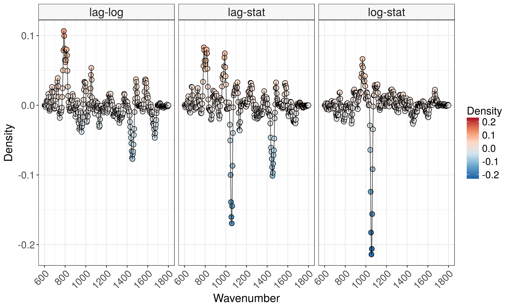
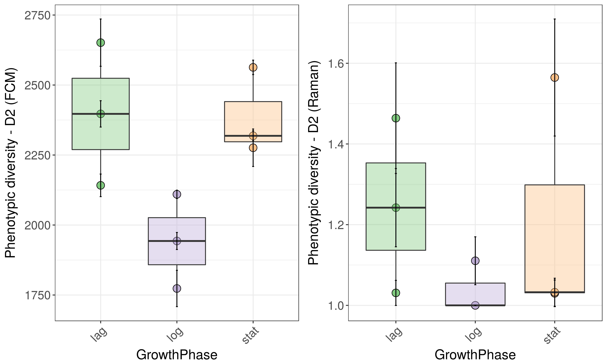

# Load libraries


```r
library("Phenoflow")
library("mclust")
library("plyr")
library("dplyr")
library("gridExtra")
library("tidyr")
library("phyloseq")
library("readr")
library("ggplot2")
library("gridExtra")
library("fpc")
library("RColorBrewer")
library("vegan")
library("tsne")
library("sandwich")
library("cluster")
library("grid")
library("egg")
library("MALDIquant")
library("hyperSpec")
library("reshape2")
library("caret") # for cross validation
library("foreach") # for parallelization
source("functions.R")
library("flowAI") # for denoising of FCM data
load("workspace.RData")

my.settings <- list(
  strip.background=list(col="transparent"),
  strip.border=list(col="transparent", cex=5),
  gate=list(col="black", fill="lightblue", alpha=0.2,border=NA,lwd=2),
  panel.background=list(col="lightgray"),
  background=list(col="white"))
```

# Cluster analysis
<!-- ## A. Hyperspec-normalized spectra -->
<!-- We will start with the hyperspec processed spectr:   -->

<!-- * Select number of stable clusters in data set -->
<!-- * Map back to original samples -->
<!-- * Calculate phenotypic diversity in each sample using Hill numbers -->

<!-- ```{r determine-clusters, fig.width = 7, fig.height= 6, dpi = 500, warning=FALSE} -->
<!-- # Choose if you want to run PCA prior to clustering -->
<!-- PCA <- FALSE -->

<!-- if(PCA == TRUE){ -->
<!--   # Perform PCA to reduce number of features in fingerprint -->
<!--   pca_bacteria <- prcomp(hs.norm) -->

<!--   # Only retain PC which explain 90% of the variance -->
<!--   thresh <- 0.9 -->
<!--   nr_pc_bacteria <- min(which((cumsum(vegan::eigenvals(pca_bacteria)/sum(vegan::eigenvals(pca_bacteria)))>thresh) == TRUE)) -->
<!--   pc_cluster_bacteria <- pca_bacteria$x[, 1:nr_pc_bacteria] -->
<!-- } else { -->
<!--   pc_cluster_bacteria <- hs.norm -->
<!-- } -->

<!-- # Evaluate number of robust clusters by means of silhouette index -->
<!-- # We limit the search to 50 clusters -->
<!-- tmp.si <- c() -->
<!-- for(i in 2:50){ -->
<!--   if(i%%10 == 0) cat(date(), paste0("---- at k =  ", i, "/",  nrow(pc_cluster_bacteria), "\n")) -->
<!--   tmp.si[i] <- pam(pc_cluster_bacteria, k = i)$silinfo$avg.width -->
<!-- } -->
<!-- nr_clusters_bacteria <- which(tmp.si == max(tmp.si, na.rm = TRUE)) -->

<!-- # Plot Silhouette index distribution -->
<!-- plot(tmp.si, type = "l", ylab = "Silhouette index",  -->
<!--      xlab = "Number of clusters") -->

<!-- # Cluster samples and export cluster labels -->
<!-- clusters_bacteria <- pam(pc_cluster_bacteria, k = nr_clusters_bacteria) -->

<!-- # Extract cluster labels -->
<!-- cluster_labels_pam <- data.frame(Sample = names(clusters_bacteria$clustering), -->
<!--                                       cluster_label = clusters_bacteria$clustering) -->

<!-- # Method 2: the Mclust( ) function in the mclust package selects the optimal model according to BIC for EM initialized by hierarchical clustering for parameterized Gaussian mixture models. -->
<!-- BIC = mclustBIC(pc_cluster_bacteria$spc, G = c(1:20)) -->
<!-- plot(BIC);lines(x = c(13, 13), y = c(0, 10e6), col = "red", lty = 2) -->
<!-- mc_fit <- Mclust(pc_cluster_bacteria, G = 13) -->

<!-- # plot(fit) # plot results  -->
<!-- summary(mc_fit) # display the best model -->

<!-- cluster_labels_mc <- data.frame(Sample = names(clusters_bacteria$clustering), -->
<!--                                       cluster_label = mc_fit$classification) -->

<!-- # To compare both clustering approaches: -->
<!-- # cluster.stats(dist(hs.norm), mc_fit$classification, clusters_bacteria$clustering) -->

<!-- # Extract count table (i.e. "operational phenotypic unit table") for each sample -->
<!-- OPU_hs_pam <- data.frame(table(cluster_labels_pam)) -->
<!-- # print(OPU_hs_pam) -->

<!-- OPU_hs_mc <- data.frame(table(cluster_labels_mc)) -->
<!-- # print(OPU_hs_mc) -->

<!-- # Merge cluster outputs in long format df -->
<!-- OPU_hs_merged <- rbind(OPU_hs_pam, OPU_hs_mc) -->
<!-- OPU_hs_merged <- data.frame(OPU_hs_merged, method = -->
<!--                               c(rep("PAM", nrow(OPU_hs_pam)), -->
<!--                                 rep("Mclust", nrow(OPU_hs_mc))),  -->
<!--                             replicate = do.call(rbind, strsplit(as.character(OPU_hs_merged$Sample), " "))[, 2], -->
<!--                             growth_phase = do.call(rbind, strsplit(as.character(OPU_hs_merged$Sample), " "))[, 1]) -->
<!-- colnames(OPU_hs_merged)[colnames(OPU_hs_merged) == "cluster_label"] <- "OPU" -->
<!-- ``` -->

<!-- # Plot OPU table -->
<!-- ```{r plot-clusters, fig.width = 7, fig.height= 6, dpi = 500, warning=FALSE} -->
<!-- # Plot according to metadata -->
<!-- p1 <- ggplot(OPU_hs_merged, aes(x = replicate, y = Freq, fill = OPU))+ -->
<!--   geom_bar(stat = "identity")+ -->
<!--   scale_fill_brewer(palette = "Paired")+ -->
<!--   theme_bw()+ -->
<!--   facet_grid(method ~ growth_phase, scales = "free")+ -->
<!--    theme(axis.title=element_text(size=16), strip.text=element_text(size=16), -->
<!--         legend.title=element_text(size=15),legend.text=element_text(size=14), -->
<!--         axis.text = element_text(size=14),title=element_text(size=20), -->
<!--         axis.text.x = element_text(angle = 45, hjust = 1), -->
<!--         strip.background=element_rect(fill=adjustcolor("lightgray",0.2)) -->
<!--         #,panel.grid.major = element_blank(), panel.grid.minor = element_blank() -->
<!--         ) -->

<!-- print(p1) -->
<!-- ``` -->

## B. Maldiquant-normalized spectra  

Same analysis as for hyperspec-normalized spectra.


```r
# Convert massSpectrum object to hyperspec
wv_mq <- mass(mq.norm[[1]])
matrix.spectra <- matrix(nrow=length(mq.norm), ncol = length(wv_mq))
for (i in 1:length(mq.norm)){
  matrix.spectra[i,] <- intensity(mq.norm[[i]])
}
hs.mq <- new("hyperSpec", spc = matrix.spectra, wavelength = wv_mq, labels = cell.name)

# Choose if you want to run PCA prior to clustering
PCA <- FALSE
PEAKS <- FALSE

if(PCA == TRUE){
  # Perform PCA to reduce number of features in fingerprint
  pca_bacteria <- prcomp(hs.mq)

  # Only retain PC which explain 90% of the variance
  thresh <- 0.9
  nr_pc_bacteria <- min(which((cumsum(vegan::eigenvals(pca_bacteria)/sum(vegan::eigenvals(pca_bacteria)))>thresh) == TRUE))
  pc_cluster_bacteria <- pca_bacteria$x[, 1:nr_pc_bacteria]
} else if(PEAKS == TRUE){
  # Run peak detection algorithm
    peaks <- detectPeaks(mq.norm, method="MAD", halfWindowSize=1, SNR=0.001)
    plot(mq.norm[[1]], xlim=c(600, 1800))
    points(peaks[[1]], col="red", pch=4)

    # Tolerance for wave number shift
    peaks <- binPeaks(peaks, tolerance = 0.002)
  
    # Filter out intensities at peak wave numbers
    peaks <- filterPeaks(peaks, minFrequency = 0.25)

    pc_cluster_bacteria <- intensityMatrix(peaks, mq.norm)
} else {
  pc_cluster_bacteria <- hs.mq
}

# Evaluate number of robust clusters by means of silhouette index
# We limit the search to 50 clusters
tmp.si <- c()
for(i in 2:50){
  if(i%%10 == 0) cat(date(), paste0("---- at k =  ", i, "/",  nrow(pc_cluster_bacteria), "\n"))
  tmp.si[i] <- pam(pc_cluster_bacteria, k = i)$silinfo$avg.width
}
```

```
## Tue Feb 20 11:48:53 2018 ---- at k =  10/536
## Tue Feb 20 11:48:56 2018 ---- at k =  20/536
## Tue Feb 20 11:49:01 2018 ---- at k =  30/536
## Tue Feb 20 11:49:11 2018 ---- at k =  40/536
## Tue Feb 20 11:49:29 2018 ---- at k =  50/536
```

```r
nr_clusters_bacteria <- which(tmp.si == max(tmp.si, na.rm = TRUE))

# Plot Silhouette index distribution
plot(tmp.si, type = "l", ylab = "Silhouette index", 
     xlab = "Number of clusters")
```


```r
# Cluster samples and export cluster labels
clusters_bacteria <- pam(pc_cluster_bacteria, k = nr_clusters_bacteria)

# Extract cluster labels
cluster_labels_pam <- data.frame(Sample = cell.name,
                                      cluster_label = clusters_bacteria$clustering)

# Method 2: the Mclust( ) function in the mclust package selects the optimal model according to BIC for EM initialized by hierarchical clustering for parameterized Gaussian mixture models.
if(PEAKS == TRUE){
  mc_fit <- Mclust(as.matrix(pc_cluster_bacteria))
} else {
  mc_fit <- Mclust(pc_cluster_bacteria, G = 13)
}

# plot(fit) # plot results 
summary(mc_fit) # display the best model
```

```
## ----------------------------------------------------
## Gaussian finite mixture model fitted by EM algorithm 
## ----------------------------------------------------
## 
## Mclust EII (spherical, equal volume) model with 13 components:
## 
##  log.likelihood   n   df     BIC     ICL
##         1250553 536 4342 2473821 2473821
## 
## Clustering table:
##  1  2  3  4  5  6  7  8  9 10 11 12 13 
## 93 85 84 25 49 81  1 60  1 53  2  1  1
```

```r
cluster_labels_mc <- data.frame(Sample = cell.name,
                                      cluster_label = mc_fit$classification)

# To compare both clustering approaches:
# cluster.stats(dist(hs.mq), mc_fit$classification, clusters_bacteria$clustering)

# Extract count table (i.e. "operational phenotypic unit table") for each sample
OPU_mq_pam <- data.frame(table(cluster_labels_pam))
# print(OPU_hs_pam)

OPU_mq_mc <- data.frame(table(cluster_labels_mc))
# print(OPU_hs_mc)

# Merge cluster outputs in long format df
OPU_mq_merged <- rbind(OPU_mq_pam, OPU_mq_mc)
OPU_mq_merged <- data.frame(OPU_mq_merged, method =
                              c(rep("PAM", nrow(OPU_mq_pam)),
                                rep("Mclust", nrow(OPU_mq_mc))), 
                            replicate = do.call(rbind, strsplit(as.character(OPU_mq_merged$Sample), " "))[, 2],
                            growth_phase = do.call(rbind, strsplit(as.character(OPU_mq_merged$Sample), " "))[, 1])
colnames(OPU_mq_merged)[colnames(OPU_mq_merged) == "cluster_label"] <- "OPU"
```

# Plot OPU table

```r
p2 <- ggplot(OPU_mq_merged, aes(x = replicate, y = Freq, fill = OPU))+
  geom_bar(stat = "identity")+
  scale_fill_brewer(palette = "Paired")+
  theme_bw()+
  facet_grid(method ~ growth_phase, scales = "free")+
   theme(axis.title=element_text(size=16), strip.text=element_text(size=16),
        legend.title=element_text(size=15),legend.text=element_text(size=14),
        axis.text = element_text(size=14),title=element_text(size=20),
        axis.text.x = element_text(angle = 45, hjust = 1),
        strip.background=element_rect(fill=adjustcolor("lightgray",0.2))
        #,panel.grid.major = element_blank(), panel.grid.minor = element_blank()
        )

print(p2)
```


# PhenoRam diversity

```r
# Format PAM clusters into otu tables
OPU_pam_table <- OPU_mq_merged %>% filter(method == "PAM") %>% select(c("Sample","OPU","Freq")) %>% tidyr::spread(OPU, Freq)
rownames(OPU_pam_table) <- OPU_pam_table$Sample
OPU_pam_table <- OPU_pam_table[, -1]
OPU_pam_tax <- as.matrix(data.frame(OPU = colnames(OPU_pam_table)))
rownames(OPU_pam_tax) <- OPU_pam_tax[,1]
OPU_pam_table2 <- phyloseq(otu_table(OPU_pam_table, taxa_are_rows = FALSE),
                           tax_table(OPU_pam_tax))

# Format Mclust clusters into otu tables
OPU_mclust_table <- OPU_mq_merged %>% filter(method == "Mclust") %>% select(c("Sample","OPU","Freq")) %>% tidyr::spread(OPU, Freq)
rownames(OPU_mclust_table) <- OPU_mclust_table$Sample
OPU_mclust_table <- OPU_mclust_table[, -1]
OPU_mclust_tax <- as.matrix(data.frame(OPU = colnames(OPU_mclust_table)))
rownames(OPU_mclust_tax) <- OPU_mclust_tax[,1]
OPU_mclust_table <- phyloseq(otu_table(OPU_mclust_table, taxa_are_rows = FALSE),
                           tax_table(OPU_mclust_tax))

div_ram_pam <- Diversity_16S(OPU_mclust_table, R = 100, brea = FALSE, 
                             parallel = TRUE, ncores = 3)
```

```
## 	**WARNING** this functions assumes that rows are samples and columns
##       	are taxa in your phyloseq object, please verify.
## Tue Feb 20 11:50:32 2018 	Using 3 cores for calculations
## Tue Feb 20 11:50:32 2018	Calculating diversity for sample 1/9 --- lag rep1
## Tue Feb 20 11:50:42 2018	Done with sample lag rep1
## Tue Feb 20 11:50:42 2018	Calculating diversity for sample 2/9 --- lag rep2
## Tue Feb 20 11:50:45 2018	Done with sample lag rep2
## Tue Feb 20 11:50:45 2018	Calculating diversity for sample 3/9 --- lag rep3
## Tue Feb 20 11:50:48 2018	Done with sample lag rep3
## Tue Feb 20 11:50:48 2018	Calculating diversity for sample 4/9 --- log rep1
## Tue Feb 20 11:50:50 2018	Done with sample log rep1
## Tue Feb 20 11:50:50 2018	Calculating diversity for sample 5/9 --- log rep2
## Tue Feb 20 11:50:53 2018	Done with sample log rep2
## Tue Feb 20 11:50:53 2018	Calculating diversity for sample 6/9 --- log rep3
## Tue Feb 20 11:50:56 2018	Done with sample log rep3
## Tue Feb 20 11:50:56 2018	Calculating diversity for sample 7/9 --- stat rep1
## Tue Feb 20 11:50:59 2018	Done with sample stat rep1
## Tue Feb 20 11:50:59 2018	Calculating diversity for sample 8/9 --- stat rep2
## Tue Feb 20 11:51:01 2018	Done with sample stat rep2
## Tue Feb 20 11:51:01 2018	Calculating diversity for sample 9/9 --- stat rep3
## Tue Feb 20 11:51:04 2018	Done with sample stat rep3
## Tue Feb 20 11:51:04 2018 	Closing workers
## Tue Feb 20 11:51:04 2018 	Done with all 9 samples
```

```r
div_ram_mclust <- Diversity_16S(OPU_pam_table2, R = 100, brea = FALSE, 
                             parallel = TRUE, ncores = 3)
```

```
## 	**WARNING** this functions assumes that rows are samples and columns
##       	are taxa in your phyloseq object, please verify.
## Tue Feb 20 11:51:05 2018 	Using 3 cores for calculations
## Tue Feb 20 11:51:05 2018	Calculating diversity for sample 1/9 --- lag rep1
## Tue Feb 20 11:51:15 2018	Done with sample lag rep1
## Tue Feb 20 11:51:15 2018	Calculating diversity for sample 2/9 --- lag rep2
## Tue Feb 20 11:51:17 2018	Done with sample lag rep2
## Tue Feb 20 11:51:17 2018	Calculating diversity for sample 3/9 --- lag rep3
## Tue Feb 20 11:51:20 2018	Done with sample lag rep3
## Tue Feb 20 11:51:20 2018	Calculating diversity for sample 4/9 --- log rep1
## Tue Feb 20 11:51:22 2018	Done with sample log rep1
## Tue Feb 20 11:51:22 2018	Calculating diversity for sample 5/9 --- log rep2
## Tue Feb 20 11:51:25 2018	Done with sample log rep2
## Tue Feb 20 11:51:25 2018	Calculating diversity for sample 6/9 --- log rep3
## Tue Feb 20 11:51:27 2018	Done with sample log rep3
## Tue Feb 20 11:51:27 2018	Calculating diversity for sample 7/9 --- stat rep1
## Tue Feb 20 11:51:30 2018	Done with sample stat rep1
## Tue Feb 20 11:51:30 2018	Calculating diversity for sample 8/9 --- stat rep2
## Tue Feb 20 11:51:33 2018	Done with sample stat rep2
## Tue Feb 20 11:51:33 2018	Calculating diversity for sample 9/9 --- stat rep3
## Tue Feb 20 11:51:36 2018	Done with sample stat rep3
## Tue Feb 20 11:51:36 2018 	Closing workers
## Tue Feb 20 11:51:36 2018 	Done with all 9 samples
```

```r
div_ram_merged <- data.frame(Sample = rep(rownames(div_ram_pam),2),
                             rbind(div_ram_pam, div_ram_mclust),
                             method = c(rep("pam", nrow(div_ram_pam)),
                                        rep("mclust", nrow(div_ram_mclust)))
                             )
div_ram_merged <- div_ram_merged[, -c(4:7)]
div_ram_merged$Sample <- as.character(div_ram_merged$Sample)

# Merge with metadata
div_ram_merged$GrowthPhase <- do.call(rbind, strsplit(div_ram_merged$Sample, " "))[,1]

# Plot results
p_ram_div_pam <- div_ram_merged %>% filter(method == "pam") %>% 
  ggplot(aes(x = GrowthPhase, y = D2, fill = GrowthPhase))+
  geom_point(shape = 21, size = 4)+
  geom_boxplot(alpha = 0.4)+
  ggplot2::theme_bw()+
     theme(axis.title=element_text(size=16), strip.text=element_text(size=16),
        legend.title=element_text(size=15),legend.text=element_text(size=14),
        axis.text = element_text(size=14),title=element_text(size=20),
        axis.text.x = element_text(angle = 45, hjust = 1),
        strip.background=element_rect(fill=adjustcolor("lightgray",0.2))
        #,panel.grid.major = element_blank(), panel.grid.minor = element_blank()
        )+
  scale_fill_brewer(palette = "Accent")+
  geom_errorbar(aes(ymin = D2 - sd.D2, ymax = D2 + sd.D2), width = 0.025)+
  guides(fill = FALSE)+
  ylab(expression("Phenotypic diversity - D2 (Raman)"))

print(p_ram_div_pam)
```


```r
p_ram_div_mclust <- div_ram_merged %>% filter(method == "mclust") %>% 
  ggplot(aes(x = GrowthPhase, y = D2, fill = GrowthPhase))+
  geom_point(shape = 21, size = 4)+
  geom_boxplot(alpha = 0.4)+
  ggplot2::theme_bw()+
     theme(axis.title=element_text(size=16), strip.text=element_text(size=16),
        legend.title=element_text(size=15),legend.text=element_text(size=14),
        axis.text = element_text(size=14),title=element_text(size=20),
        axis.text.x = element_text(angle = 45, hjust = 1),
        strip.background=element_rect(fill=adjustcolor("lightgray",0.2))
        #,panel.grid.major = element_blank(), panel.grid.minor = element_blank()
        )+
  scale_fill_brewer(palette = "Accent")+
  geom_errorbar(aes(ymin = D2 - sd.D2, ymax = D2 + sd.D2), width = 0.025)+
  guides(fill = FALSE)+
  ylab(expression("Phenotypic diversity - D2 (Raman)"))

print(p_ram_div_mclust)
```


# Contrast analysis
## Hyperspec normalized  


```r
# ram_contrast(hyprs = hs.norm, comp1 = c("LB rep1", "LB rep2", "LB rep3"), 
# comp2 = c("NB rep1","NB rep2","NB rep3"))
ram.hs_lag_log <- ram_contrast(hs.norm, comp1 = c("lag rep1", "lag rep2", "lag rep3"),
              comp2 = c("log rep1", "log rep2", "log rep3"), plot = FALSE)
```

```
## -----------------------------------------------------------------------------------------------------
##  
## 	 Your cells are distributed over these samples:
## 
##  Samples
##  lag rep1  lag rep2  lag rep3  log rep1  log rep2  log rep3 stat rep1 
##        60        62        61        58        60        59        59 
## stat rep2 stat rep3 
##        56        61 
## -----------------------------------------------------------------------------------------------------
##  
## 	 Returning contrasts between mean spectra for 183 cells of
##  c("lag rep1", "lag rep2", "lag rep3")
## 	 and 177 cells of
##  c("log rep1", "log rep2", "log rep3")
## -----------------------------------------------------------------------------------------------------
## 
```

```r
ram.hs_lag_stat <- ram_contrast(hs.norm, comp1 = c("lag rep1", "lag rep2", "lag rep3"),
              comp2 = c("stat rep1", "stat rep2", "stat rep3"), plot = FALSE)
```

```
## -----------------------------------------------------------------------------------------------------
##  
## 	 Your cells are distributed over these samples:
## 
##  Samples
##  lag rep1  lag rep2  lag rep3  log rep1  log rep2  log rep3 stat rep1 
##        60        62        61        58        60        59        59 
## stat rep2 stat rep3 
##        56        61 
## -----------------------------------------------------------------------------------------------------
##  
## 	 Returning contrasts between mean spectra for 183 cells of
##  c("lag rep1", "lag rep2", "lag rep3")
## 	 and 176 cells of
##  c("stat rep1", "stat rep2", "stat rep3")
## -----------------------------------------------------------------------------------------------------
## 
```

```r
ram.hs_log_stat <- ram_contrast(hs.norm, comp1 = c("log rep1", "log rep2", "log rep3"),
              comp2 = c("stat rep1", "stat rep2", "stat rep3"), plot = FALSE)
```

```
## -----------------------------------------------------------------------------------------------------
##  
## 	 Your cells are distributed over these samples:
## 
##  Samples
##  lag rep1  lag rep2  lag rep3  log rep1  log rep2  log rep3 stat rep1 
##        60        62        61        58        60        59        59 
## stat rep2 stat rep3 
##        56        61 
## -----------------------------------------------------------------------------------------------------
##  
## 	 Returning contrasts between mean spectra for 177 cells of
##  c("log rep1", "log rep2", "log rep3")
## 	 and 176 cells of
##  c("stat rep1", "stat rep2", "stat rep3")
## -----------------------------------------------------------------------------------------------------
## 
```

```r
ram.hs_merged <- data.frame(rbind(ram.hs_lag_log, ram.hs_lag_stat, ram.hs_log_stat),
                            Comparison = rep(c("lag-log", "lag-stat", "log-stat"), 
                                               each = nrow(ram.hs_lag_stat))
)

v.hs <- ggplot2::ggplot(ram.hs_merged, ggplot2::aes(x = Wavenumber, y = Density, fill = Density))+
  ggplot2::geom_point(shape = 21, colour="black", alpha = 1.0,
                          size = 3)+
  geom_line(color = "black", alpha = 0.6)+
  facet_grid(.~Comparison)+
  ggplot2::scale_fill_distiller(palette="RdBu", na.value="white", limits = c(-0.22,0.22)) +
  scale_x_continuous(breaks = seq(600,1800,200), labels = seq(600,1800,200))+
  ggplot2::theme_bw()+
     theme(axis.title=element_text(size=16), strip.text=element_text(size=16),
        legend.title=element_text(size=15),legend.text=element_text(size=14),
        axis.text = element_text(size=14),title=element_text(size=20),
        axis.text.x = element_text(angle = 45, hjust = 1),
        strip.background=element_rect(fill=adjustcolor("lightgray",0.2))
        #,panel.grid.major = element_blank(), panel.grid.minor = element_blank()
        )

print(v.hs)
```


## Maldiquant normalized  


```r
# ram_contrast(hyprs = hs.norm, comp1 = c("LB rep1", "LB rep2", "LB rep3"), 
# comp2 = c("NB rep1","NB rep2","NB rep3"))
ram.mq_lag_log <- ram_contrast(hs.mq, comp1 = c("lag rep1", "lag rep2", "lag rep3"),
              comp2 = c("log rep1", "log rep2", "log rep3"), plot = FALSE)
```

```
## -----------------------------------------------------------------------------------------------------
##  
## 	 Your cells are distributed over these samples:
## 
##  Samples
##  lag rep1  lag rep2  lag rep3  log rep1  log rep2  log rep3 stat rep1 
##        60        62        61        58        60        59        59 
## stat rep2 stat rep3 
##        56        61 
## -----------------------------------------------------------------------------------------------------
##  
## 	 Returning contrasts between mean spectra for 183 cells of
##  c("lag rep1", "lag rep2", "lag rep3")
## 	 and 177 cells of
##  c("log rep1", "log rep2", "log rep3")
## -----------------------------------------------------------------------------------------------------
## 
```

```r
ram.mq_lag_stat <- ram_contrast(hs.mq, comp1 = c("lag rep1", "lag rep2", "lag rep3"),
              comp2 = c("stat rep1", "stat rep2", "stat rep3"), plot = FALSE)
```

```
## -----------------------------------------------------------------------------------------------------
##  
## 	 Your cells are distributed over these samples:
## 
##  Samples
##  lag rep1  lag rep2  lag rep3  log rep1  log rep2  log rep3 stat rep1 
##        60        62        61        58        60        59        59 
## stat rep2 stat rep3 
##        56        61 
## -----------------------------------------------------------------------------------------------------
##  
## 	 Returning contrasts between mean spectra for 183 cells of
##  c("lag rep1", "lag rep2", "lag rep3")
## 	 and 176 cells of
##  c("stat rep1", "stat rep2", "stat rep3")
## -----------------------------------------------------------------------------------------------------
## 
```

```r
ram.mq_log_stat <- ram_contrast(hs.mq, comp1 = c("log rep1", "log rep2", "log rep3"),
              comp2 = c("stat rep1", "stat rep2", "stat rep3"), plot = FALSE)
```

```
## -----------------------------------------------------------------------------------------------------
##  
## 	 Your cells are distributed over these samples:
## 
##  Samples
##  lag rep1  lag rep2  lag rep3  log rep1  log rep2  log rep3 stat rep1 
##        60        62        61        58        60        59        59 
## stat rep2 stat rep3 
##        56        61 
## -----------------------------------------------------------------------------------------------------
##  
## 	 Returning contrasts between mean spectra for 177 cells of
##  c("log rep1", "log rep2", "log rep3")
## 	 and 176 cells of
##  c("stat rep1", "stat rep2", "stat rep3")
## -----------------------------------------------------------------------------------------------------
## 
```

```r
ram.mq_merged <- data.frame(rbind(ram.mq_lag_log, ram.mq_lag_stat, ram.mq_log_stat),
                            Comparison = rep(c("lag-log", "lag-stat", "log-stat"), 
                                               each = nrow(ram.mq_lag_stat))
)

v.mq <- ggplot2::ggplot(ram.mq_merged, ggplot2::aes(x = Wavenumber, y = Density, fill = Density))+
  ggplot2::geom_point(shape = 21, colour="black", alpha = 1.0,
                          size = 3)+
  geom_line(color = "black", alpha = 0.6)+
  facet_grid(.~Comparison)+
  ggplot2::scale_fill_distiller(palette="RdBu", na.value="white", limits = c(-0.22,0.22)) +
  scale_x_continuous(breaks = seq(600,1800,200), labels = seq(600,1800,200))+
  ggplot2::theme_bw()+
     theme(axis.title=element_text(size=16), strip.text=element_text(size=16),
        legend.title=element_text(size=15),legend.text=element_text(size=14),
        axis.text = element_text(size=14),title=element_text(size=20),
        axis.text.x = element_text(angle = 45, hjust = 1),
        strip.background=element_rect(fill=adjustcolor("lightgray",0.2))
        #,panel.grid.major = element_blank(), panel.grid.minor = element_blank()
        )

print(v.mq)
```



# Flow cytometry data

### Alpha diversity analysis  


```r
# Import data in FCS format
fs <- flowCore::read.flowSet(path = "./FCSfiles", pattern = ".fcs")

# Extract metadata from sample names
meta_fs <- do.call(rbind, strsplit(flowCore::sampleNames(fs), " "))[,2]
meta_fs <- data.frame(Sample = flowCore::sampleNames(fs),
                      Organism = do.call(rbind, strsplit(meta_fs, "_"))[,1],
                      GrowthPhase = do.call(rbind, strsplit(meta_fs, "_"))[,2],
                      Replicate= do.call(rbind, strsplit(meta_fs, "_"))[,3],
                      Dilution= do.call(rbind, strsplit(meta_fs, "_"))[,4])
meta_fs$Dilution <- as.numeric(gsub(".fcs", "", meta_fs$Dilution))

# Transform data with asinh
# Select phenotypic features of interest and transform parameters
fs <- flowCore::transform(fs,`FL1-H`=asinh(`FL1-H`), 
                                   `SSC-H`=asinh(`SSC-H`), 
                                   `FL3-H`=asinh(`FL3-H`), 
                                   `FSC-H`=asinh(`FSC-H`))
param=c("FL1-H", "FL3-H","SSC-H","FSC-H")

# Denoise data
### Create a PolygonGate for denoising the dataset
### Define coordinates for gate in sqrcut1 in format: c(x,x,x,x,y,y,y,y)
sqrcut1 <- matrix(c(7.75,7.75,14,14,3,7.75,14,3),ncol=2, nrow=4)
colnames(sqrcut1) <- c("FL1-H","FL3-H")
polyGate1 <- polygonGate(.gate=sqrcut1, filterId = "Total Cells")

###  Gating quality check
xyplot(`FL3-H` ~ `FL1-H`, data=fs[1], filter=polyGate1,
       scales=list(y=list(limits=c(0,14)),
                   x=list(limits=c(6,16))),
       axis = axis.default, nbin=125, 
       par.strip.text=list(col="white", font=2, cex=2), smooth=FALSE)
```


```r
### Isolate only the cellular information based on the polyGate1
fs <- Subset(fs, polyGate1)

#Normalize
summary <- fsApply(x = fs, FUN = function(x) apply(x, 2, max), use.exprs = TRUE)
maxval <- max(summary[,9])
mytrans <- function(x) x/maxval
fs <- transform(fs,`FL1-H`=mytrans(`FL1-H`),
                                  `FL3-H`=mytrans(`FL3-H`), 
                                  `SSC-H`=mytrans(`SSC-H`),
                                  `FSC-H`=mytrans(`FSC-H`))

# Calculate phenotypic diversity
# fs <- FCS_resample(fs, sample = 60, replace = TRUE)
fs_div <- Diversity_rf(fs, param = param, R.b = 100, R = 100, cleanFCS = FALSE,
                       parallel = TRUE, ncores = 3)
```

```
## --- parameters are already normalized at: 1
## Tue Feb 20 11:51:53 2018 --- Using 3 cores for calculations
## Tue Feb 20 11:54:43 2018 --- Closing workers
## Tue Feb 20 11:54:43 2018 --- Alpha diversity metrics (D0,D1,D2) have been computed after 100 bootstraps
## -----------------------------------------------------------------------------------------------------
## 
```

```r
## Plot alpha diversity vs growth phase
fs_div <- dplyr::left_join(fs_div, meta_fs, by = c("Sample_names"="Sample"))

p_fs_div <- ggplot(fs_div, aes(x = GrowthPhase, y = D2, fill = GrowthPhase))+
  geom_point(shape = 21, size = 4)+
  geom_boxplot(alpha = 0.4)+
  ggplot2::theme_bw()+
     theme(axis.title=element_text(size=16), strip.text=element_text(size=16),
        legend.title=element_text(size=15),legend.text=element_text(size=14),
        axis.text = element_text(size=14),title=element_text(size=20),
        axis.text.x = element_text(angle = 45, hjust = 1),
        strip.background=element_rect(fill=adjustcolor("lightgray",0.2))
        #,panel.grid.major = element_blank(), panel.grid.minor = element_blank()
        )+
  scale_fill_brewer(palette = "Accent")+
  geom_errorbar(aes(ymin = D2 - sd.D2, ymax = D2 + sd.D2), width = 0.025)+
  guides(fill = FALSE)+
  ylab(expression("Phenotypic diversity - D2 (FCM)"))

# Compare FCM diversity (left hand side) with Raman diversity (right hand side)
grid.arrange(p_fs_div, p_ram_div_mclust, ncol = 2)
```



### Contrast analysis  


```r
# Calculate fingerprint
fbasis <- flowBasis(fs, param, nbin=128, 
                   bw=0.01,normalize=function(x) x)

# Calculate contrasts
fp_c_lag_log <- fp_contrasts(fbasis, comp1 = meta_fs$GrowthPhase=="lag", comp2 = 
               meta_fs$GrowthPhase=="log", thresh = 0.05)
```

```
## 	Region used for contrasts 1 16384
## 	Returning contrasts for A01 Ecoli_lag_rep1_1000.fcs A01 Ecoli_log_rep1_10000.fcs
##  	Returning contrasts for A02 Ecoli_lag_rep2_1000.fcs A02 Ecoli_log_rep2_10000.fcs
##  	Returning contrasts for A03 Ecoli_lag_rep3_1000.fcs A03 Ecoli_log_rep3_100000.fcs
```

```r
fp_c_lag_stat <- fp_contrasts(fbasis, comp1 = meta_fs$GrowthPhase=="lag", comp2 = 
               meta_fs$GrowthPhase=="stat", thresh = 0.05)
```

```
## 	Region used for contrasts 1 16384
## 	Returning contrasts for A01 Ecoli_lag_rep1_1000.fcs A01 Ecoli_stat_rep1_10000.fcs
##  	Returning contrasts for A02 Ecoli_lag_rep2_1000.fcs A02 Ecoli_stat_rep2_10000.fcs
##  	Returning contrasts for A03 Ecoli_lag_rep3_1000.fcs A03 Ecoli_stat_rep3_10000.fcs
```

```r
fp_c_log_stat <- fp_contrasts(fbasis, comp1 = meta_fs$GrowthPhase=="log", comp2 = 
               meta_fs$GrowthPhase=="stat", thresh = 0.05)
```

```
## 	Region used for contrasts 1 16384
## 	Returning contrasts for A01 Ecoli_log_rep1_10000.fcs A01 Ecoli_stat_rep1_10000.fcs
##  	Returning contrasts for A02 Ecoli_log_rep2_10000.fcs A02 Ecoli_stat_rep2_10000.fcs
##  	Returning contrasts for A03 Ecoli_log_rep3_100000.fcs A03 Ecoli_stat_rep3_10000.fcs
```

```r
fp_c_merge <- data.frame(rbind(fp_c_lag_log, fp_c_lag_stat, fp_c_log_stat),
                         Comparison = c(rep("lag-log", nrow(fp_c_lag_log)),
                                        rep("lag-stat", nrow(fp_c_lag_stat)),
                                        rep("log-stat", nrow(fp_c_log_stat))))
# Plot contrasts
v.fp_c <- ggplot2::ggplot(fp_c_merge, ggplot2::aes(x = FL1.H, y = FL3.H, fill = Density, 
                                                   z = Density))+
  geom_tile(aes(fill=Density)) + 
  geom_point(colour="gray", alpha=0.7)+
  scale_fill_distiller(palette="RdYlBu", na.value="white") + 
  stat_contour(aes(fill=..level..), geom="polygon", binwidth=0.1)+
  theme_bw()+
  # geom_line()+
  facet_grid(.~Comparison)+
  # scale_x_continuous(breaks = seq(600,1800,200), labels = seq(600,1800,200))+
  theme(axis.title=element_text(size=16), strip.text=element_text(size=16),
        legend.title=element_text(size=15),legend.text=element_text(size=14),
        axis.text = element_text(size=14),title=element_text(size=20),
        axis.text.x = element_text(angle = 45, hjust = 1),
        strip.background=element_rect(fill=adjustcolor("lightgray",0.2))
        #,panel.grid.major = element_blank(), panel.grid.minor = element_blank()
        )+
  labs(x="Green fluorescence intensity (a.u.)", y="Red fluorescence intensity (a.u.)")

print(v.fp_c)
```


### Beta diversity analysis


```r
# Calculate beta diversity
beta.div <- beta_div_fcm(fbasis, ord.type="PCoA")

# Plot ordination
plot_beta_fcm(beta.div, color = meta_fs$GrowthPhase, labels="Growth phase") + 
  theme_bw() +
  geom_point(size = 8, alpha = 0.5)+
  ggtitle("")
```


```r
# Juxtaposition with beta-diversity based on Raman data
```

# tSNE

## Flow cytometry


```r
# Calculate the dissimilarity matrix
dist_fbasis_sample <- dist(fbasis@basis)
tsne_fbasis <- tsne::tsne(dist_fbasis_sample, 
                          perplexity = 5)
```

```
## sigma summary: Min. : 12.5709245723508 |1st Qu. : 19.2135377420559 |Median : 20.9792132965026 |Mean : 20.9191497359823 |3rd Qu. : 22.082868101704 |Max. : 28.1623460431449 |
```

```
## Epoch: Iteration #100 error is: 16.2166825704257
```

```
## Epoch: Iteration #200 error is: 0.80091757309097
```

```
## Epoch: Iteration #300 error is: 0.521594381749651
```

```
## Epoch: Iteration #400 error is: 0.494656312092242
```

```
## Epoch: Iteration #500 error is: 0.480375979470678
```

```
## Epoch: Iteration #600 error is: 0.34316163694454
```

```
## Epoch: Iteration #700 error is: 0.22793942456359
```

```
## Epoch: Iteration #800 error is: 0.106205953080816
```

```
## Epoch: Iteration #900 error is: 0.0898143692038221
```

```
## Epoch: Iteration #1000 error is: 0.066014061377917
```

```r
tsne_fbasis <- data.frame(tsne_fbasis, Sample = rownames(fbasis@basis))
colnames(tsne_fbasis)[1:2] <- c("Axis1", "Axis2")
tsne_fbasis <- dplyr::left_join(tsne_fbasis, meta_fs, by = "Sample")

p_tsne_fbasis <- ggplot2::ggplot(tsne_fbasis, ggplot2::aes(x = Axis1, y = Axis2, 
        fill = GrowthPhase)) + 
  ggplot2::geom_point(alpha = 0.7, 
        size = 8, shape = 21, colour = "black") + 
  ggplot2::scale_fill_manual(values = c("#a65628", "red", 
            "#ffae19", "#4daf4a", "#1919ff", "darkorchid3", "magenta")) +
  ggplot2::labs(x = paste0("Axis1"), y = paste0("Axis2"))+
  theme_bw()+
    theme(axis.title=element_text(size=16), strip.text=element_text(size=16),
        legend.title=element_text(size=15),legend.text=element_text(size=14),
        axis.text = element_text(size=14),title=element_text(size=20),
        strip.background=element_rect(fill=adjustcolor("lightgray",0.2)))

print(p_tsne_fbasis)
```


## Raman data


```r
# At single cell level
dist_ram_cells <- dist(hs.mq@data)
tsne_ram.c <- tsne::tsne(dist_ram_cells)
```

```
## sigma summary: Min. : 0.0131363067079677 |1st Qu. : 0.0200191227308468 |Median : 0.021848832655061 |Mean : 0.0239405053832849 |3rd Qu. : 0.025763593149787 |Max. : 0.0505763424606676 |
```

```
## Epoch: Iteration #100 error is: 10.3382138456538
```

```
## Epoch: Iteration #200 error is: 0.273775635716397
```

```
## Epoch: Iteration #300 error is: 0.233781842048801
```

```
## Epoch: Iteration #400 error is: 0.221333601993142
```

```
## Epoch: Iteration #500 error is: 0.216942732459677
```

```
## Epoch: Iteration #600 error is: 0.214481930307848
```

```
## Epoch: Iteration #700 error is: 0.212726808921806
```

```
## Epoch: Iteration #800 error is: 0.211327549246717
```

```
## Epoch: Iteration #900 error is: 0.21012537193512
```

```
## Epoch: Iteration #1000 error is: 0.209065598747353
```

```r
tsne_ram.c <- data.frame(tsne_ram.c, GrowthPhase = do.call(rbind, strsplit(cell.name, " "))[,1], replicate = do.call(rbind, strsplit(cell.name, " "))[,2])
colnames(tsne_ram.c)[1:2] <- c("Axis1", "Axis2")

p_tsne_ram.c <- ggplot2::ggplot(tsne_ram.c, ggplot2::aes(x = Axis1, y = Axis2, 
        fill = GrowthPhase, shape = Replicate)) + 
    ggplot2::scale_fill_manual(values = c("#a65628", "red", 
            "#ffae19", "#4daf4a", "#1919ff", "darkorchid3", "magenta")) +
  ggplot2::geom_point(alpha = 0.7, 
        size = 4, colour = "black") + 
  scale_shape_manual(values = c(21,22,24))+
  ggplot2::labs(x = paste0("Axis1"), y = paste0("Axis2"))+
  theme_bw()+
  theme(axis.title=element_text(size=16), strip.text=element_text(size=16),
        legend.title=element_text(size=15),legend.text=element_text(size=14),
        axis.text = element_text(size=14),title=element_text(size=20),
        strip.background=element_rect(fill=adjustcolor("lightgray",0.2)))

print(p_tsne_ram.c)
```


# Ramanome data

```r
# Import ramanome data
df.Ramanone <- read_csv("Ramanome.zip")
```

```
## Multiple files in zip: reading 'External_data/total data.csv'
```

```
## Parsed with column specification:
## cols(
##   .default = col_double(),
##   Point = col_character(),
##   sampleID = col_character(),
##   group = col_character(),
##   group_1 = col_character()
## )
```

```
## See spec(...) for full column specifications.
```

```r
mat.Ramanome <- as.matrix(df.Ramanone[, - c(1:4)])

# df.Ramanone <- reshape2::melt(df.Ramanone)
hs.ramanome <- new("hyperSpec", spc = mat.Ramanome, 
                    wavelength = as.numeric(as.character(colnames(mat.Ramanome))),
                    labels = df.Ramanone$sampleID)
rownames(hs.ramanome) <- df.Ramanone$sampleID


# Cluster cells
OPU_hs_ramanome <- ram_clust(hs.ramanome, ram_object = "hs", nclust = 20, PCA = FALSE)
```

```
## Tue Feb 20 12:47:40 2018 ---- at k =  10/5284
## Tue Feb 20 13:00:18 2018 ---- at k =  20/5284
```


```r
# Add metadata and group information 
OPU_hs_ramanome <- left_join(OPU_hs_ramanome, df.Ramanone[, 2:4], by = c("Sample_label" = "sampleID"))

# Fix some bad group labels
OPU_hs_ramanome$group_1 <- gsub("_1|_2|_3", "", OPU_hs_ramanome$group_1)

# Get contigency table for PAM per group
OPU_hs_ramanome_PAM <- OPU_hs_ramanome %>% dplyr::filter(method == "PAM")
OPU_hs_ramanome_PAM <- data.frame(table(OPU_hs_ramanome_PAM[, c("OPU", "group_1")]))

# Get contigency table for MClust per group
OPU_hs_ramanome_mclust <- OPU_hs_ramanome %>% dplyr::filter(method == "Mclust")
OPU_hs_ramanome_mclust <- data.frame(table(OPU_hs_ramanome_mclust[, c("OPU", "group_1")]))

# Format Mclust clusters into otu tables
OPU_mclust_table_sp <- OPU_hs_ramanome_mclust %>% tidyr::spread(OPU, Freq)
rownames(OPU_mclust_table_sp) <- OPU_mclust_table_sp$group_1
OPU_mclust_table_sp <- OPU_mclust_table_sp[, -1]
OPU_mclust_tax <- as.matrix(data.frame(OPU = colnames(OPU_mclust_table_sp)))
rownames(OPU_mclust_tax) <- OPU_mclust_tax[,1]
OPU_mclust_table_sp <- phyloseq(otu_table(OPU_mclust_table_sp, taxa_are_rows = FALSE),
                           tax_table(OPU_mclust_tax))

div_ram_mclust <- Diversity_16S(OPU_mclust_table_sp, R = 100, brea = FALSE, 
                             parallel = TRUE, ncores = 10)
```

```
## 	**WARNING** this functions assumes that rows are samples and columns
##       	are taxa in your phyloseq object, please verify.
## Tue Feb 20 21:29:40 2018 	Using 10 cores for calculations
## Tue Feb 20 21:29:40 2018	Calculating diversity for sample 1/82 --- amp_h3
## Tue Feb 20 21:29:54 2018	Done with sample amp_h3
## Tue Feb 20 21:29:54 2018	Calculating diversity for sample 2/82 --- amp_h5
## Tue Feb 20 21:29:55 2018	Done with sample amp_h5
## Tue Feb 20 21:29:55 2018	Calculating diversity for sample 3/82 --- amp_min10
## Tue Feb 20 21:29:56 2018	Done with sample amp_min10
## Tue Feb 20 21:29:56 2018	Calculating diversity for sample 4/82 --- amp_min20
## Tue Feb 20 21:29:57 2018	Done with sample amp_min20
## Tue Feb 20 21:29:57 2018	Calculating diversity for sample 5/82 --- amp_min30
## Tue Feb 20 21:29:58 2018	Done with sample amp_min30
## Tue Feb 20 21:29:58 2018	Calculating diversity for sample 6/82 --- amp_min5
## Tue Feb 20 21:30:00 2018	Done with sample amp_min5
## Tue Feb 20 21:30:00 2018	Calculating diversity for sample 7/82 --- amp_min60
## Tue Feb 20 21:30:01 2018	Done with sample amp_min60
## Tue Feb 20 21:30:01 2018	Calculating diversity for sample 8/82 --- but_5h
## Tue Feb 20 21:30:02 2018	Done with sample but_5h
## Tue Feb 20 21:30:02 2018	Calculating diversity for sample 9/82 --- but_h3
## Tue Feb 20 21:30:03 2018	Done with sample but_h3
## Tue Feb 20 21:30:03 2018	Calculating diversity for sample 10/82 --- but_min10
## Tue Feb 20 21:30:04 2018	Done with sample but_min10
## Tue Feb 20 21:30:09 2018	Calculating diversity for sample 11/82 --- but_min20
## Tue Feb 20 21:30:10 2018	Done with sample but_min20
## Tue Feb 20 21:30:10 2018	Calculating diversity for sample 12/82 --- but_min30
## Tue Feb 20 21:30:11 2018	Done with sample but_min30
## Tue Feb 20 21:30:11 2018	Calculating diversity for sample 13/82 --- but_min5
## Tue Feb 20 21:30:12 2018	Done with sample but_min5
## Tue Feb 20 21:30:12 2018	Calculating diversity for sample 14/82 --- but_min60
## Tue Feb 20 21:30:13 2018	Done with sample but_min60
## Tue Feb 20 21:30:13 2018	Calculating diversity for sample 15/82 --- camp_h3
## Tue Feb 20 21:30:14 2018	Done with sample camp_h3
## Tue Feb 20 21:30:14 2018	Calculating diversity for sample 16/82 --- camp_h5
## Tue Feb 20 21:30:15 2018	Done with sample camp_h5
## Tue Feb 20 21:30:15 2018	Calculating diversity for sample 17/82 --- camp_min10
## Tue Feb 20 21:30:16 2018	Done with sample camp_min10
## Tue Feb 20 21:30:16 2018	Calculating diversity for sample 18/82 --- camp_min20
## Tue Feb 20 21:30:17 2018	Done with sample camp_min20
## Tue Feb 20 21:30:17 2018	Calculating diversity for sample 19/82 --- camp_min30
## Tue Feb 20 21:30:18 2018	Done with sample camp_min30
## Tue Feb 20 21:30:18 2018	Calculating diversity for sample 20/82 --- camp_min5
## Tue Feb 20 21:30:19 2018	Done with sample camp_min5
## Tue Feb 20 21:30:19 2018	Calculating diversity for sample 21/82 --- camp_min60
## Tue Feb 20 21:30:21 2018	Done with sample camp_min60
## Tue Feb 20 21:30:21 2018	Calculating diversity for sample 22/82 --- cbut_5h
## Tue Feb 20 21:30:22 2018	Done with sample cbut_5h
## Tue Feb 20 21:30:22 2018	Calculating diversity for sample 23/82 --- cbut_h3
## Tue Feb 20 21:30:23 2018	Done with sample cbut_h3
## Tue Feb 20 21:30:23 2018	Calculating diversity for sample 24/82 --- cbut_min10
## Tue Feb 20 21:30:24 2018	Done with sample cbut_min10
## Tue Feb 20 21:30:24 2018	Calculating diversity for sample 25/82 --- cbut_min20
## Tue Feb 20 21:30:25 2018	Done with sample cbut_min20
## Tue Feb 20 21:30:25 2018	Calculating diversity for sample 26/82 --- cbut_min30
## Tue Feb 20 21:30:26 2018	Done with sample cbut_min30
## Tue Feb 20 21:30:26 2018	Calculating diversity for sample 27/82 --- cbut_min5
## Tue Feb 20 21:30:27 2018	Done with sample cbut_min5
## Tue Feb 20 21:30:27 2018	Calculating diversity for sample 28/82 --- cbut_min60
## Tue Feb 20 21:30:28 2018	Done with sample cbut_min60
## Tue Feb 20 21:30:28 2018	Calculating diversity for sample 29/82 --- ccrcu_h3
## Tue Feb 20 21:30:29 2018	Done with sample ccrcu_h3
## Tue Feb 20 21:30:29 2018	Calculating diversity for sample 30/82 --- ccrcu_h5
## Tue Feb 20 21:30:30 2018	Done with sample ccrcu_h5
## Tue Feb 20 21:30:30 2018	Calculating diversity for sample 31/82 --- ccrcu_min60
## Tue Feb 20 21:30:31 2018	Done with sample ccrcu_min60
## Tue Feb 20 21:30:31 2018	Calculating diversity for sample 32/82 --- ccr_min10
## Tue Feb 20 21:30:32 2018	Done with sample ccr_min10
## Tue Feb 20 21:30:32 2018	Calculating diversity for sample 33/82 --- ccr_min20
## Tue Feb 20 21:30:33 2018	Done with sample ccr_min20
## Tue Feb 20 21:30:33 2018	Calculating diversity for sample 34/82 --- ccr_min30
## Tue Feb 20 21:30:34 2018	Done with sample ccr_min30
## Tue Feb 20 21:30:34 2018	Calculating diversity for sample 35/82 --- ccr_min5
## Tue Feb 20 21:30:35 2018	Done with sample ccr_min5
## Tue Feb 20 21:30:35 2018	Calculating diversity for sample 36/82 --- ccu_min10
## Tue Feb 20 21:30:36 2018	Done with sample ccu_min10
## Tue Feb 20 21:30:36 2018	Calculating diversity for sample 37/82 --- ccu_min20
## Tue Feb 20 21:30:37 2018	Done with sample ccu_min20
## Tue Feb 20 21:30:37 2018	Calculating diversity for sample 38/82 --- ccu_min30
## Tue Feb 20 21:30:38 2018	Done with sample ccu_min30
## Tue Feb 20 21:30:38 2018	Calculating diversity for sample 39/82 --- ccu_min5
## Tue Feb 20 21:30:39 2018	Done with sample ccu_min5
## Tue Feb 20 21:30:39 2018	Calculating diversity for sample 40/82 --- ceth_h3
## Tue Feb 20 21:30:40 2018	Done with sample ceth_h3
## Tue Feb 20 21:30:40 2018	Calculating diversity for sample 41/82 --- ceth_h5
## Tue Feb 20 21:30:41 2018	Done with sample ceth_h5
## Tue Feb 20 21:30:41 2018	Calculating diversity for sample 42/82 --- ceth_min10
## Tue Feb 20 21:30:42 2018	Done with sample ceth_min10
## Tue Feb 20 21:30:42 2018	Calculating diversity for sample 43/82 --- ceth_min20
## Tue Feb 20 21:30:43 2018	Done with sample ceth_min20
## Tue Feb 20 21:30:43 2018	Calculating diversity for sample 44/82 --- ceth_min30
## Tue Feb 20 21:30:44 2018	Done with sample ceth_min30
## Tue Feb 20 21:30:44 2018	Calculating diversity for sample 45/82 --- ceth_min5
## Tue Feb 20 21:30:45 2018	Done with sample ceth_min5
## Tue Feb 20 21:30:45 2018	Calculating diversity for sample 46/82 --- ceth_min60
## Tue Feb 20 21:30:46 2018	Done with sample ceth_min60
## Tue Feb 20 21:30:46 2018	Calculating diversity for sample 47/82 --- ckanamp_h3
## Tue Feb 20 21:30:48 2018	Done with sample ckanamp_h3
## Tue Feb 20 21:30:48 2018	Calculating diversity for sample 48/82 --- ckan_h5
## Tue Feb 20 21:30:49 2018	Done with sample ckan_h5
## Tue Feb 20 21:30:49 2018	Calculating diversity for sample 49/82 --- ckan_min10
## Tue Feb 20 21:30:50 2018	Done with sample ckan_min10
## Tue Feb 20 21:30:50 2018	Calculating diversity for sample 50/82 --- ckan_min20
## Tue Feb 20 21:30:51 2018	Done with sample ckan_min20
## Tue Feb 20 21:30:51 2018	Calculating diversity for sample 51/82 --- ckan_min30
## Tue Feb 20 21:30:52 2018	Done with sample ckan_min30
## Tue Feb 20 21:30:52 2018	Calculating diversity for sample 52/82 --- ckan_min5
## Tue Feb 20 21:30:53 2018	Done with sample ckan_min5
## Tue Feb 20 21:30:53 2018	Calculating diversity for sample 53/82 --- ckan_min60
## Tue Feb 20 21:30:54 2018	Done with sample ckan_min60
## Tue Feb 20 21:30:54 2018	Calculating diversity for sample 54/82 --- cr_h3
## Tue Feb 20 21:30:55 2018	Done with sample cr_h3
## Tue Feb 20 21:30:55 2018	Calculating diversity for sample 55/82 --- cr_h5
## Tue Feb 20 21:30:56 2018	Done with sample cr_h5
## Tue Feb 20 21:30:56 2018	Calculating diversity for sample 56/82 --- cr_min10
## Tue Feb 20 21:30:57 2018	Done with sample cr_min10
## Tue Feb 20 21:30:57 2018	Calculating diversity for sample 57/82 --- cr_min20
## Tue Feb 20 21:30:58 2018	Done with sample cr_min20
## Tue Feb 20 21:30:58 2018	Calculating diversity for sample 58/82 --- cr_min30
## Tue Feb 20 21:30:59 2018	Done with sample cr_min30
## Tue Feb 20 21:30:59 2018	Calculating diversity for sample 59/82 --- cr_min5
## Tue Feb 20 21:31:00 2018	Done with sample cr_min5
## Tue Feb 20 21:31:00 2018	Calculating diversity for sample 60/82 --- cr_min60
## Tue Feb 20 21:31:01 2018	Done with sample cr_min60
## Tue Feb 20 21:31:01 2018	Calculating diversity for sample 61/82 --- cu_h3
## Tue Feb 20 21:31:02 2018	Done with sample cu_h3
## Tue Feb 20 21:31:02 2018	Calculating diversity for sample 62/82 --- cu_h5
## Tue Feb 20 21:31:03 2018	Done with sample cu_h5
## Tue Feb 20 21:31:03 2018	Calculating diversity for sample 63/82 --- cu_min10
## Tue Feb 20 21:31:04 2018	Done with sample cu_min10
## Tue Feb 20 21:31:04 2018	Calculating diversity for sample 64/82 --- cu_min20
## Tue Feb 20 21:31:05 2018	Done with sample cu_min20
## Tue Feb 20 21:31:05 2018	Calculating diversity for sample 65/82 --- cu_min30
## Tue Feb 20 21:31:06 2018	Done with sample cu_min30
## Tue Feb 20 21:31:06 2018	Calculating diversity for sample 66/82 --- cu_min5
## Tue Feb 20 21:31:07 2018	Done with sample cu_min5
## Tue Feb 20 21:31:07 2018	Calculating diversity for sample 67/82 --- cu_min60
## Tue Feb 20 21:31:08 2018	Done with sample cu_min60
## Tue Feb 20 21:31:08 2018	Calculating diversity for sample 68/82 --- eth_h3
## Tue Feb 20 21:31:10 2018	Done with sample eth_h3
## Tue Feb 20 21:31:10 2018	Calculating diversity for sample 69/82 --- eth_h5
## Tue Feb 20 21:31:11 2018	Done with sample eth_h5
## Tue Feb 20 21:31:11 2018	Calculating diversity for sample 70/82 --- eth_min10
## Tue Feb 20 21:31:12 2018	Done with sample eth_min10
## Tue Feb 20 21:31:12 2018	Calculating diversity for sample 71/82 --- eth_min20
## Tue Feb 20 21:31:13 2018	Done with sample eth_min20
## Tue Feb 20 21:31:13 2018	Calculating diversity for sample 72/82 --- eth_min30
## Tue Feb 20 21:31:14 2018	Done with sample eth_min30
## Tue Feb 20 21:31:14 2018	Calculating diversity for sample 73/82 --- eth_min5
## Tue Feb 20 21:31:15 2018	Done with sample eth_min5
## Tue Feb 20 21:31:15 2018	Calculating diversity for sample 74/82 --- eth_min60
## Tue Feb 20 21:31:16 2018	Done with sample eth_min60
## Tue Feb 20 21:31:16 2018	Calculating diversity for sample 75/82 --- kan_h3
## Tue Feb 20 21:31:17 2018	Done with sample kan_h3
## Tue Feb 20 21:31:17 2018	Calculating diversity for sample 76/82 --- kan_h5
## Tue Feb 20 21:31:18 2018	Done with sample kan_h5
## Tue Feb 20 21:31:18 2018	Calculating diversity for sample 77/82 --- kan_min10
## Tue Feb 20 21:31:19 2018	Done with sample kan_min10
## Tue Feb 20 21:31:19 2018	Calculating diversity for sample 78/82 --- kan_min20
## Tue Feb 20 21:31:20 2018	Done with sample kan_min20
## Tue Feb 20 21:31:20 2018	Calculating diversity for sample 79/82 --- kan_min30
## Tue Feb 20 21:31:21 2018	Done with sample kan_min30
## Tue Feb 20 21:31:21 2018	Calculating diversity for sample 80/82 --- kan_min5
## Tue Feb 20 21:31:22 2018	Done with sample kan_min5
## Tue Feb 20 21:31:22 2018	Calculating diversity for sample 81/82 --- kan_min60
## Tue Feb 20 21:31:24 2018	Done with sample kan_min60
## Tue Feb 20 21:31:24 2018	Calculating diversity for sample 82/82 --- min0
## Tue Feb 20 21:31:25 2018	Done with sample min0
## Tue Feb 20 21:31:25 2018 	Closing workers
## Tue Feb 20 21:31:25 2018 	Done with all 82 samples
```

```r
div_ram_results <- data.frame(SampleID = rownames(div_ram_mclust), div_ram_mclust,
                              Treatment = do.call(rbind, base::strsplit("_", x = as.character(div_ram_results$SampleID)))[, 1],
                              Timepoint = do.call(rbind, base::strsplit("_", x = as.character(div_ram_results$SampleID)))[, 2]
)
```

```
## Error in base::strsplit("_", x = as.character(div_ram_results$SampleID)): object 'div_ram_results' not found
```

```r
div_ram_results$Timepoint[div_ram_results$Timepoint == "5h"] <- "h5"
```

```
## Error in div_ram_results$Timepoint[div_ram_results$Timepoint == "5h"] <- "h5": object 'div_ram_results' not found
```

```r
div_ram_results$Timepoint <- factor(as.character(div_ram_results$Timepoint),
                                    levels = c("min0", "min5", "min10", "min20", "min30", "min60","h3", "h5"))
```

```
## Error in factor(as.character(div_ram_results$Timepoint), levels = c("min0", : object 'div_ram_results' not found
```


```r
# Plot results
p_ram_div_mclust <- div_ram_results %>% dplyr::filter(Timepoint != "min0") %>% 
  ggplot(aes(x = Timepoint, y = D2))+
  geom_point(shape = 21, size = 4, fill = "lightblue")+
  # geom_boxplot(alpha = 0.4)+
  ggplot2::theme_bw()+
     theme(axis.title=element_text(size=16), strip.text=element_text(size=16),
        legend.title=element_text(size=15),legend.text=element_text(size=14),
        axis.text = element_text(size=14),title=element_text(size=20),
        axis.text.x = element_text(angle = 45, hjust = 1),
        strip.background=element_rect(fill=adjustcolor("lightgray",0.2))
        #,panel.grid.major = element_blank(), panel.grid.minor = element_blank()
        )+
  scale_fill_brewer(palette = "Accent")+
  facet_wrap(~Treatment, ncol = 4)+
  geom_errorbar(aes(ymin = D2 - sd.D2, ymax = D2 + sd.D2), width = 0.025)+
  guides(fill = FALSE)+
  ylab(expression("Phenotypic diversity - D2 (Raman)"))+
  ylim(0,3)
```

```
## Error in eval(lhs, parent, parent): object 'div_ram_results' not found
```

```r
print(p_ram_div_mclust)
```


```r
# At single cell level
dist_ram_cells <- dist(hs.ramanome@data)
tsne_ram.ramano <- tsne::tsne(dist_ram_cells)
```

```
## sigma summary: Min. : 0.0449931944152712 |1st Qu. : 0.0615784127951392 |Median : 0.0674722700563012 |Mean : 0.0785796125820395 |3rd Qu. : 0.0766288494018514 |Max. : 0.204728864983115 |
```

```
## Epoch: Iteration #100 error is: 26.5667585538527
```

```
## Epoch: Iteration #200 error is: 2.654587008298
```

```
## Epoch: Iteration #300 error is: 2.49635910996362
```

```
## Epoch: Iteration #400 error is: 2.43157763906048
```

```
## Epoch: Iteration #500 error is: 2.40369612980713
```

```
## Epoch: Iteration #600 error is: 2.3873832650934
```

```
## Epoch: Iteration #700 error is: 2.37646007329124
```

```
## Epoch: Iteration #800 error is: 2.36845609613973
```

```
## Epoch: Iteration #900 error is: 2.36224708967142
```

```
## Epoch: Iteration #1000 error is: 2.35722819347934
```

```r
tsne_ram.ramano <- data.frame(tsne_ram.ramano, Treatment = do.call(rbind, base::strsplit("_", x = as.character(df.Ramanone$sampleID)))[, 1])


colnames(tsne_ram.ramano)[1:2] <- c("Axis1", "Axis2")

p_tsne_ram.c <- ggplot2::ggplot(tsne_ram.ramano, ggplot2::aes(x = Axis1, y = Axis2, 
        fill = Treatment)) + 
    ggplot2::scale_fill_brewer(palette = "Paired") +
  ggplot2::geom_point(alpha = 0.7, 
        size = 4, colour = "black", shape = 21) + 
  ggplot2::labs(x = paste0("Axis1"), y = paste0("Axis2"))+
  theme_bw()+
  theme(axis.title=element_text(size=16), strip.text=element_text(size=16),
        legend.title=element_text(size=15),legend.text=element_text(size=14),
        axis.text = element_text(size=14),title=element_text(size=20),
        strip.background=element_rect(fill=adjustcolor("lightgray",0.2)))

print(p_tsne_ram.c)
```


