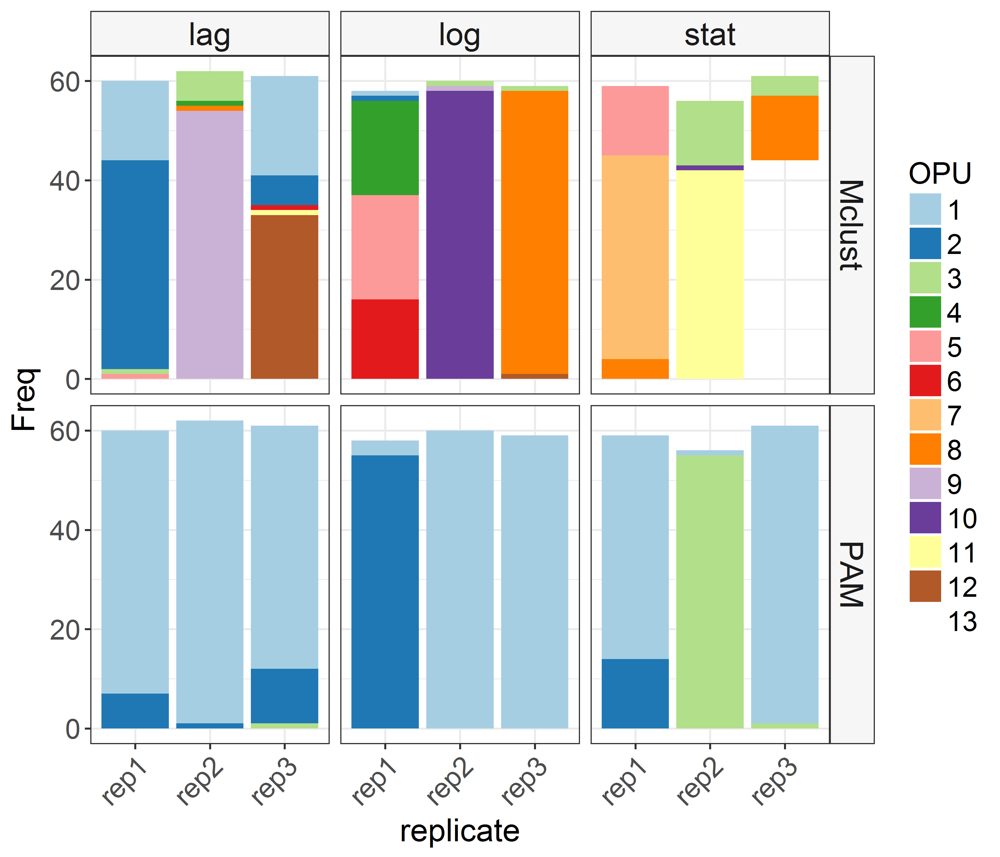

# PhenoRam analysis
Cristina Garcia Timmermans & Ruben Props  
Today  


# Load libraries


```r
library("Phenoflow")
library("mclust")
library("plyr")
library("dplyr")
library("gridExtra")
library("ggplot2")
library("gridExtra")
library("fpc")
library("RColorBrewer")
library("vegan")
library("sandwich")
library("cluster")
library("grid")
library("egg")
library("MALDIquant")
library("reshape2")
library("caret") # for cross validation
library("foreach") # for parallelization
source("functions.R")
library("flowAI") # for denoising of FCM data
load("workspace.RData")

my.settings <- list(
  strip.background=list(col="transparent"),
  strip.border=list(col="transparent", cex=5),
  gate=list(col="black", fill="lightblue", alpha=0.2,border=NA,lwd=2),
  panel.background=list(col="lightgray"),
  background=list(col="white"))
```

# Cluster analysis
## A. Hyperspec-normalized spectra
We will start with the hyperspec processed spectr:  

* Select number of stable clusters in data set
* Map back to original samples
* Calculate phenotypic diversity in each sample using Hill numbers


```r
# Choose if you want to run PCA prior to clustering
PCA <- TRUE

if(PCA == TRUE){
  # Perform PCA to reduce number of features in fingerprint
  pca_bacteria <- prcomp(hs.norm)

  # Only retain PC which explain 90% of the variance
  thresh <- 0.9
  nr_pc_bacteria <- min(which((cumsum(vegan::eigenvals(pca_bacteria)/sum(vegan::eigenvals(pca_bacteria)))>thresh) == TRUE))
  pc_cluster_bacteria <- pca_bacteria$x[, 1:nr_pc_bacteria]
} else {
  pc_cluster_bacteria <- hs.norm
}
```

```
## Loading required package: hyperSpec
```

```
## Package hyperSpec, version 0.99-20171005
## 
## To get started, try
##    vignette ("hyperspec")
##    package?hyperSpec 
##    vignette (package = "hyperSpec")
## 
## If you use this package please cite it appropriately.
##    citation("hyperSpec")
## will give you the correct reference.
## 
## The project homepage is http://hyperspec.r-forge.r-project.org
```

```
## 
## Attaching package: 'hyperSpec'
```

```
## The following object is masked from 'package:dplyr':
## 
##     collapse
```

```
## The following object is masked from 'package:plyr':
## 
##     empty
```

```r
# Evaluate number of robust clusters by means of silhouette index
# We limit the search to 50 clusters
tmp.si <- c()
for(i in 2:50){
  if(i%%10 == 0) cat(date(), paste0("---- at k =  ", i, "/",  nrow(pc_cluster_bacteria), "\n"))
  tmp.si[i] <- pam(pc_cluster_bacteria, k = i)$silinfo$avg.width
}
```

```
## Mon Nov 20 16:19:24 2017 ---- at k =  10/536
## Mon Nov 20 16:19:27 2017 ---- at k =  20/536
## Mon Nov 20 16:19:34 2017 ---- at k =  30/536
## Mon Nov 20 16:19:41 2017 ---- at k =  40/536
## Mon Nov 20 16:19:52 2017 ---- at k =  50/536
```

```r
nr_clusters_bacteria <- which(tmp.si == max(tmp.si, na.rm = TRUE))

# Plot Silhouette index distribution
plot(tmp.si, type = "l", ylab = "Silhouette index", 
     xlab = "Number of clusters")
```


```r
# Cluster samples and export cluster labels
clusters_bacteria <- pam(pc_cluster_bacteria, k = nr_clusters_bacteria)

# Extract cluster labels
cluster_labels_pam <- data.frame(Sample = names(clusters_bacteria$clustering),
                                      cluster_label = clusters_bacteria$clustering)

# Method 2: the Mclust( ) function in the mclust package selects the optimal model according to BIC for EM initialized by hierarchical clustering for parameterized Gaussian mixture models.
# BIC = mclustBIC(pc_cluster_bacteria$spc, G = c(1:10), modeNames = c("VVI"))
# plot(BIC)
mc_fit <- Mclust(pc_cluster_bacteria, G = c(1:10))

# plot(fit) # plot results 
summary(mc_fit) # display the best model
```

```
## ----------------------------------------------------
## Gaussian finite mixture model fitted by EM algorithm 
## ----------------------------------------------------
## 
## Mclust VVE (ellipsoidal, equal orientation) model with 10 components:
## 
##  log.likelihood   n  df     BIC      ICL
##        28704.31 536 225 55994.7 55990.77
## 
## Clustering table:
##  1  2  3  4  5  6  7  8  9 10 
## 59 62 36 63 24 58 59 59 69 47
```

```r
cluster_labels_mc <- data.frame(Sample = names(clusters_bacteria$clustering),
                                      cluster_label = mc_fit$classification)

# To compare both clustering approaches:
# cluster.stats(dist(hs.norm), mc_fit$classification, clusters_bacteria$clustering)

# Extract count table (i.e. "operational phenotypic unit table") for each sample
OPU_hs_pam <- data.frame(table(cluster_labels_pam))
# print(OPU_hs_pam)

OPU_hs_mc <- data.frame(table(cluster_labels_mc))
# print(OPU_hs_mc)

# Merge cluster outputs in long format df
OPU_hs_merged <- rbind(OPU_hs_pam, OPU_hs_mc)
OPU_hs_merged <- data.frame(OPU_hs_merged, method =
                              c(rep("PAM", nrow(OPU_hs_pam)),
                                rep("Mclust", nrow(OPU_hs_mc))), 
                            replicate = do.call(rbind, strsplit(as.character(OPU_hs_merged$Sample), " "))[, 2],
                            growth_phase = do.call(rbind, strsplit(as.character(OPU_hs_merged$Sample), " "))[, 1])
colnames(OPU_hs_merged)[colnames(OPU_hs_merged) == "cluster_label"] <- "OPU"
```

# Plot OPU table

```r
# Plot according to metadata
p1 <- ggplot(OPU_hs_merged, aes(x = replicate, y = Freq, fill = OPU))+
  geom_bar(stat = "identity")+
  scale_fill_brewer(palette = "Paired")+
  theme_bw()+
  facet_grid(method ~ growth_phase, scales = "free")+
   theme(axis.title=element_text(size=16), strip.text=element_text(size=16),
        legend.title=element_text(size=15),legend.text=element_text(size=14),
        axis.text = element_text(size=14),title=element_text(size=20),
        axis.text.x = element_text(angle = 45, hjust = 1),
        strip.background=element_rect(fill=adjustcolor("lightgray",0.2))
        #,panel.grid.major = element_blank(), panel.grid.minor = element_blank()
        )

print(p1)
```



## B. Maldiquant-normalized spectra  

Same analysis as for hyperspec-normalized spectra.


```r
# Convert massSpectrum object to hyperspec
wv_mq <- mass(mq.norm[[1]])
matrix.spectra <- matrix(nrow=length(mq.norm), ncol = length(wv_mq))
for (i in 1:length(mq.norm)){
  matrix.spectra[i,] <- intensity(mq.norm[[i]])
}
hs.mq <- new ("hyperSpec", spc = matrix.spectra, wavelength = wv_mq, labels = cell.name)

# Choose if you want to run PCA prior to clustering
PCA <- TRUE

if(PCA == TRUE){
  # Perform PCA to reduce number of features in fingerprint
  pca_bacteria <- prcomp(hs.mq)

  # Only retain PC which explain 90% of the variance
  thresh <- 0.9
  nr_pc_bacteria <- min(which((cumsum(vegan::eigenvals(pca_bacteria)/sum(vegan::eigenvals(pca_bacteria)))>thresh) == TRUE))
  pc_cluster_bacteria <- pca_bacteria$x[, 1:nr_pc_bacteria]
} else {
  pc_cluster_bacteria <- hs.mq
}

# Evaluate number of robust clusters by means of silhouette index
# We limit the search to 50 clusters
tmp.si <- c()
for(i in 2:50){
  if(i%%10 == 0) cat(date(), paste0("---- at k =  ", i, "/",  nrow(pc_cluster_bacteria), "\n"))
  tmp.si[i] <- pam(pc_cluster_bacteria, k = i)$silinfo$avg.width
}
```

```
## Mon Nov 20 16:20:04 2017 ---- at k =  10/536
## Mon Nov 20 16:20:07 2017 ---- at k =  20/536
## Mon Nov 20 16:20:13 2017 ---- at k =  30/536
## Mon Nov 20 16:20:20 2017 ---- at k =  40/536
## Mon Nov 20 16:20:32 2017 ---- at k =  50/536
```

```r
nr_clusters_bacteria <- which(tmp.si == max(tmp.si, na.rm = TRUE))

# Plot Silhouette index distribution
plot(tmp.si, type = "l", ylab = "Silhouette index", 
     xlab = "Number of clusters")
```


```r
# Cluster samples and export cluster labels
clusters_bacteria <- pam(pc_cluster_bacteria, k = nr_clusters_bacteria)

# Extract cluster labels
cluster_labels_pam <- data.frame(Sample = cell.name,
                                      cluster_label = clusters_bacteria$clustering)

# Method 2: the Mclust( ) function in the mclust package selects the optimal model according to BIC for EM initialized by hierarchical clustering for parameterized Gaussian mixture models.
mc_fit <- Mclust(pc_cluster_bacteria, G = c(1:10))
# plot(fit) # plot results 
summary(mc_fit) # display the best model
```

```
## ----------------------------------------------------
## Gaussian finite mixture model fitted by EM algorithm 
## ----------------------------------------------------
## 
## Mclust VVE (ellipsoidal, equal orientation) model with 10 components:
## 
##  log.likelihood   n  df     BIC      ICL
##        28704.31 536 225 55994.7 55990.77
## 
## Clustering table:
##  1  2  3  4  5  6  7  8  9 10 
## 59 62 36 63 24 58 59 59 69 47
```

```r
cluster_labels_mc <- data.frame(Sample = cell.name,
                                      cluster_label = mc_fit$classification)

# To compare both clustering approaches:
# cluster.stats(dist(hs.mq), mc_fit$classification, clusters_bacteria$clustering)

# Extract count table (i.e. "operational phenotypic unit table") for each sample
OPU_mq_pam <- data.frame(table(cluster_labels_pam))
# print(OPU_hs_pam)

OPU_mq_mc <- data.frame(table(cluster_labels_mc))
# print(OPU_hs_mc)

# Merge cluster outputs in long format df
OPU_mq_merged <- rbind(OPU_mq_pam, OPU_mq_mc)
OPU_mq_merged <- data.frame(OPU_mq_merged, method =
                              c(rep("PAM", nrow(OPU_mq_pam)),
                                rep("Mclust", nrow(OPU_mq_mc))), 
                            replicate = do.call(rbind, strsplit(as.character(OPU_mq_merged$Sample), " "))[, 2],
                            growth_phase = do.call(rbind, strsplit(as.character(OPU_mq_merged$Sample), " "))[, 1])
colnames(OPU_mq_merged)
```

```
## [1] "Sample"        "cluster_label" "Freq"          "method"       
## [5] "replicate"     "growth_phase"
```

```r
colnames(OPU_mq_merged)[colnames(OPU_mq_merged) == "cluster_label"] <- "OPU"
```

# Plot OPU table

```r
p2 <- ggplot(OPU_mq_merged, aes(x = replicate, y = Freq, fill = OPU))+
  geom_bar(stat = "identity")+
  scale_fill_brewer(palette = "Paired")+
  theme_bw()+
  facet_grid(method ~ growth_phase, scales = "free")+
   theme(axis.title=element_text(size=16), strip.text=element_text(size=16),
        legend.title=element_text(size=15),legend.text=element_text(size=14),
        axis.text = element_text(size=14),title=element_text(size=20),
        axis.text.x = element_text(angle = 45, hjust = 1),
        strip.background=element_rect(fill=adjustcolor("lightgray",0.2))
        #,panel.grid.major = element_blank(), panel.grid.minor = element_blank()
        )

print(p2)
```


